# Business Process Flows — Steve Void Social Platform

> **Mục đích**: Tổng hợp 5 nhóm nghiệp vụ chính (Auth, Content, Engagement, Bookmark, Notification) với cấu trúc 3-lane Swimlane.
> **Nguồn**: `Docs/life-1/01-vision/FR/feature-map-and-priority.md`, `Docs/life-2/specs/`

---

# Part 1: Authentication Flows (M1)

## 1.1 Đăng ký tài khoản — UC01

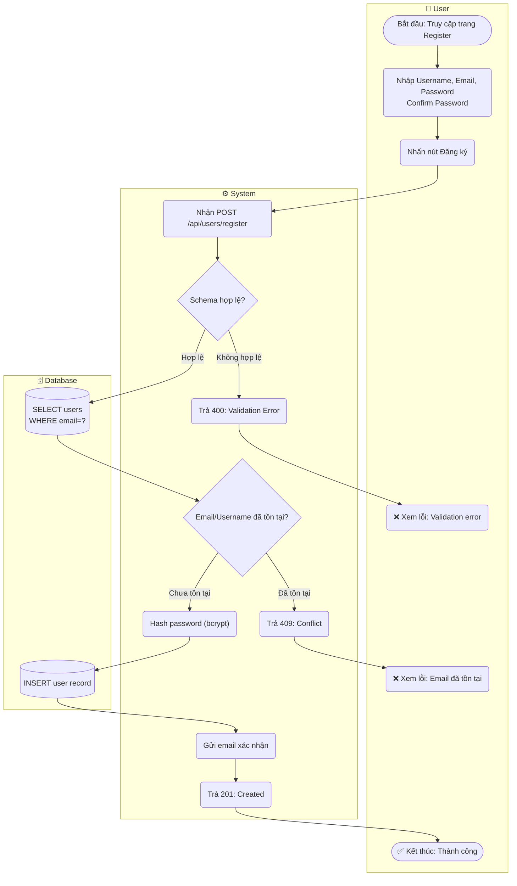
```mermaid
flowchart TD
  subgraph User ["👤 User"]
    direction TB
    U1(["Bắt đầu: Truy cập trang Register"])
    U2("Nhập Username, Email, Password<br/>Confirm Password")
    U3("Nhấn nút Đăng ký")
    U4("❌ Xem lỗi: Email đã tồn tại")
    U5("❌ Xem lỗi: Validation error")
    U6(["✅ Kết thúc: Thành công"])
  end

  subgraph System ["⚙️ System"]
    direction TB
    S1("Nhận POST /api/users/register")
    S2{"Schema hợp lệ?"}
    S3{"Email/Username đã tồn tại?"}
    S4("Hash password (bcrypt)")
    S5("Gửi email xác nhận")
    S6("Trả 400: Validation Error")
    S7("Trả 409: Conflict")
    S8("Trả 201: Created")
  end

  subgraph DB ["🗄️ Database"]
    direction TB
    D1[("SELECT users<br/>WHERE email=?")]
    D2[("INSERT user record")]
  end

  U1 --> U2 --> U3 --> S1 --> S2
  S2 -- "Không hợp lệ" --> S6 --> U5
  S2 -- "Hợp lệ" --> D1
  D1 --> S3
  S3 -- "Đã tồn tại" --> S7 --> U4
  S3 -- "Chưa tồn tại" --> S4 --> D2 --> S5 --> S8 --> U6

  %% UC-ID: UC01
```

## 1.2 Đăng nhập Email/Password — UC02

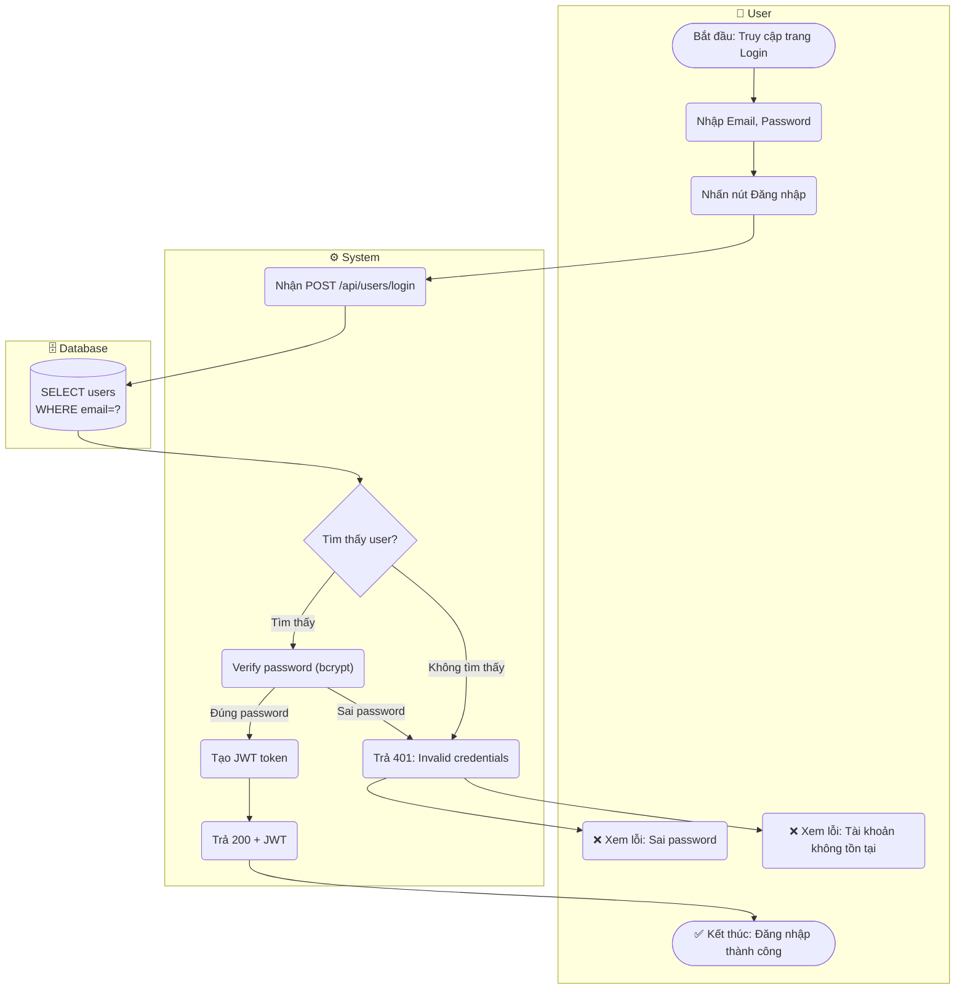
```mermaid
flowchart TD
  subgraph User ["👤 User"]
    direction TB
    U1(["Bắt đầu: Truy cập trang Login"])
    U2("Nhập Email, Password")
    U3("Nhấn nút Đăng nhập")
    U4("❌ Xem lỗi: Sai password")
    U5("❌ Xem lỗi: Tài khoản không tồn tại")
    U6(["✅ Kết thúc: Đăng nhập thành công"])
  end

  subgraph System ["⚙️ System"]
    direction TB
    S1("Nhận POST /api/users/login")
    S2{"Tìm thấy user?"}
    S3("Verify password (bcrypt)")
    S4("Tạo JWT token")
    S5("Trả 401: Invalid credentials")
    S6("Trả 200 + JWT")
  end

  subgraph DB ["🗄️ Database"]
    direction TB
    D1[("SELECT users<br/>WHERE email=?")]
  end

  U1 --> U2 --> U3 --> S1 --> D1
  D1 --> S2
  S2 -- "Không tìm thấy" --> S5 --> U5
  S2 -- "Tìm thấy" --> S3
  S3 -- "Sai password" --> S5 --> U4
  S3 -- "Đúng password" --> S4 --> S6 --> U6

  %% UC-ID: UC02
```

## 1.3 Đăng nhập OAuth (Google) — UC03

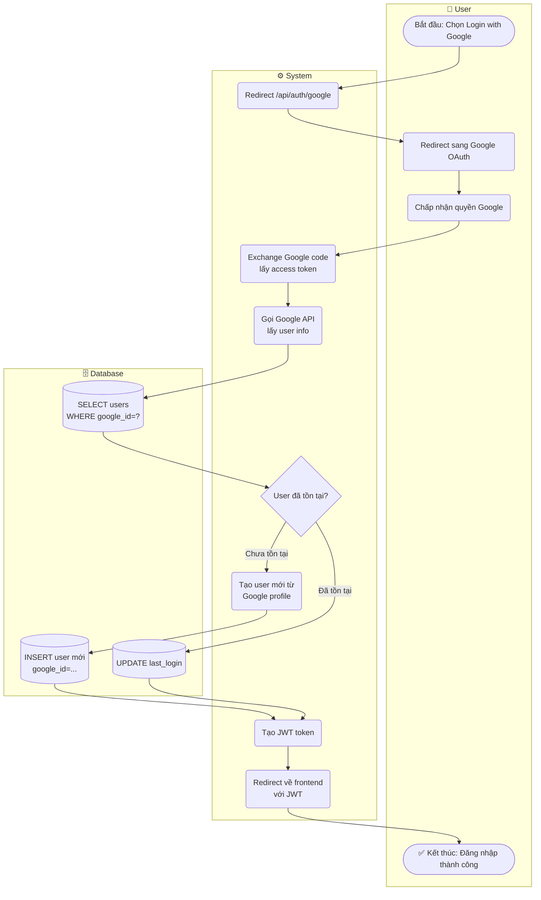
```mermaid
flowchart TD
  subgraph User ["👤 User"]
    direction TB
    U1(["Bắt đầu: Chọn Login with Google"])
    U2("Redirect sang Google OAuth")
    U3("Chấp nhận quyền Google")
    U4(["✅ Kết thúc: Đăng nhập thành công"])
  end

  subgraph System ["⚙️ System"]
    direction TB
    S1("Redirect /api/auth/google")
    S2("Exchange Google code<br/>lấy access token")
    S3("Gọi Google API<br/>lấy user info")
    S4{"User đã tồn tại?"}
    S5("Tạo user mới từ<br/>Google profile")
    S6("Tạo JWT token")
    S7("Redirect về frontend<br/>với JWT")
  end

  subgraph DB ["🗄️ Database"]
    direction TB
    D1[("SELECT users<br/>WHERE google_id=?")]
    D2[("INSERT user mới<br/>google_id=...")]
    D3[("UPDATE last_login")]
  end

  U1 --> S1 --> U2 --> U3
  U3 --> S2 --> S3 --> D1
  D1 --> S4
  S4 -- "Chưa tồn tại" --> S5 --> D2
  S4 -- "Đã tồn tại" --> D3
  D2 --> S6
  D3 --> S6
  S6 --> S7 --> U4

  %% UC-ID: UC03
```

## 1.4 Đăng xuất — UC04

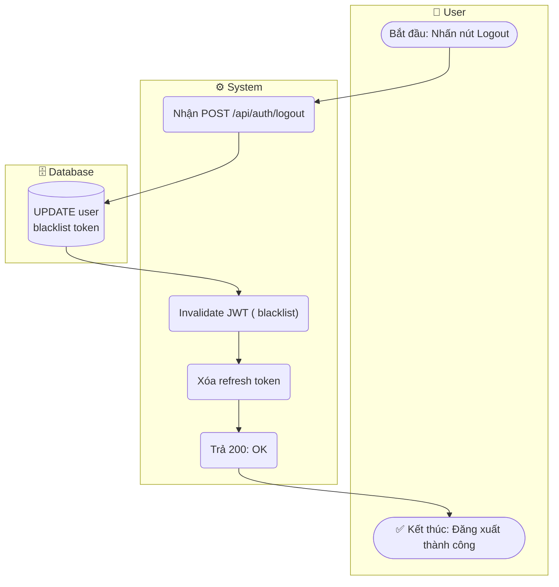
```mermaid
flowchart TD
  subgraph User ["👤 User"]
    direction TB
    U1(["Bắt đầu: Nhấn nút Logout"])
    U2(["✅ Kết thúc: Đăng xuất thành công"])
  end

  subgraph System ["⚙️ System"]
    direction TB
    S1("Nhận POST /api/auth/logout")
    S2("Invalidate JWT ( blacklist)")
    S3("Xóa refresh token")
    S4("Trả 200: OK")
  end

  subgraph DB ["🗄️ Database"]
    direction TB
    D1[("UPDATE user<br/> blacklist token")]
  end

  U1 --> S1 --> D1 --> S2 --> S3 --> S4 --> U2

  %% UC-ID: UC04
```

## 1.5 Quên mật khẩu / Reset Password — UC05

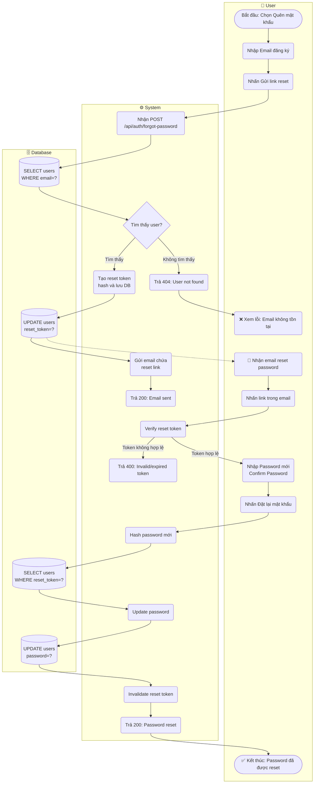
```mermaid
flowchart TD
  subgraph User ["👤 User"]
    direction TB
    U1(["Bắt đầu: Chọn Quên mật khẩu"])
    U2("Nhập Email đăng ký")
    U3("Nhấn Gửi link reset")
    U4("❌ Xem lỗi: Email không tồn tại")
    U5("📧 Nhận email reset password")
    U6("Nhấn link trong email")
    U7("Nhập Password mới<br/>Confirm Password")
    U8("Nhấn Đặt lại mật khẩu")
    U9(["✅ Kết thúc: Password đã được reset"])
  end

  subgraph System ["⚙️ System"]
    direction TB
    S1("Nhận POST /api/auth/forgot-password")
    S2{"Tìm thấy user?"}
    S3("Tạo reset token<br/>hash và lưu DB")
    S4("Gửi email chứa<br/>reset link")
    S5("Trả 200: Email sent")
    S6("Trả 404: User not found")
    S7("Verify reset token")
    S8("Hash password mới")
    S9("Update password")
    S10("Invalidate reset token")
    S11("Trả 200: Password reset")
    S12("Trả 400: Invalid/expired token")
  end

  subgraph DB ["🗄️ Database"]
    direction TB
    D1[("SELECT users<br/>WHERE email=?")]
    D2[("UPDATE users<br/>reset_token=?")]
    D3[("SELECT users<br/>WHERE reset_token=?")]
    D4[("UPDATE users<br/>password=?")]
  end

  U1 --> U2 --> U3 --> S1 --> D1
  D1 --> S2
  S2 -- "Không tìm thấy" --> S6 --> U4
  S2 -- "Tìm thấy" --> S3 --> D2 --> S4 --> S5
  D2 -.-> U5
  U5 --> U6 --> S7
  S7 -- "Token hợp lệ" --> U7 --> U8 --> S8 --> D3 --> S9 --> D4 --> S10 --> S11 --> U9
  S7 -- "Token không hợp lệ" --> S12

  %% UC-ID: UC05
```

---

# Part 2: Content Engine Flows (M2)

## 2.1 Tạo bài viết — UC08

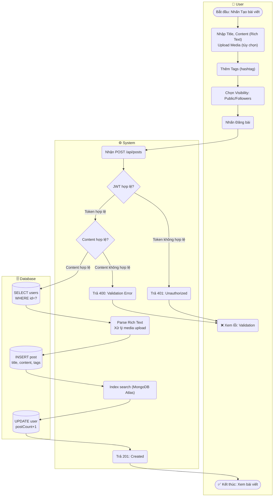
```mermaid
flowchart TD
  subgraph User ["👤 User"]
    direction TB
    U1(["Bắt đầu: Nhấn Tạo bài viết"])
    U2("Nhập Title, Content (Rich Text)<br/>Upload Media (tùy chọn)")
    U3("Thêm Tags (hashtag)")
    U4("Chọn Visibility: Public/Followers")
    U5("Nhấn Đăng bài")
    U6("❌ Xem lỗi: Validation")
    U7(["✅ Kết thúc: Xem bài viết"])
  end

  subgraph System ["⚙️ System"]
    direction TB
    S1("Nhận POST /api/posts")
    S2{"JWT hợp lệ?"}
    S3{"Content hợp lệ?"}
    S4("Parse Rich Text<br/>Xử lý media upload")
    S5("Index search (MongoDB Atlas)")
    S6("Trả 401: Unauthorized")
    S7("Trả 400: Validation Error")
    S8("Trả 201: Created")
  end

  subgraph DB ["🗄️ Database"]
    direction TB
    D1[("SELECT users<br/>WHERE id=?")]
    D2[("INSERT post<br/>title, content, tags")]
    D3[("UPDATE user<br/>postCount+1")]
  end

  U1 --> U2 --> U3 --> U4 --> U5 --> S1 --> S2
  S2 -- "Token không hợp lệ" --> S6 --> U6
  S2 -- "Token hợp lệ" --> S3
  S3 -- "Content không hợp lệ" --> S7 --> U6
  S3 -- "Content hợp lệ" --> D1
  D1 --> S4 --> D2 --> S5 --> D3 --> S8 --> U7

  %% UC-ID: UC08
```

## 2.2 Chỉnh sửa/Xóa bài viết — UC09

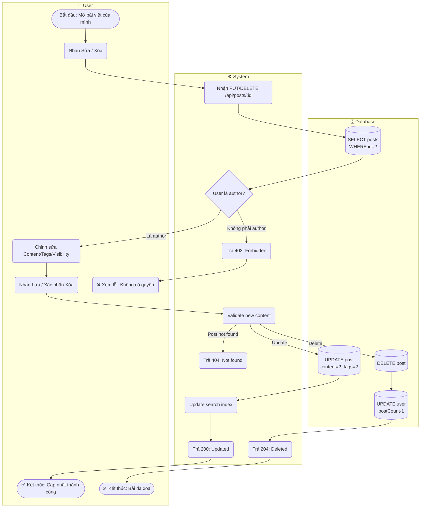
```mermaid
flowchart TD
  subgraph User ["👤 User"]
    direction TB
    U1(["Bắt đầu: Mở bài viết của mình"])
    U2("Nhấn Sửa / Xóa")
    U3("Chỉnh sửa Content/Tags/Visibility")
    U4("Nhấn Lưu / Xác nhận Xóa")
    U5("❌ Xem lỗi: Không có quyền")
    U6(["✅ Kết thúc: Cập nhật thành công"])
    U7(["✅ Kết thúc: Bài đã xóa"])
  end

  subgraph System ["⚙️ System"]
    direction TB
    S1("Nhận PUT/DELETE /api/posts/:id")
    S2{"User là author?"}
    S3("Validate new content")
    S4("Update search index")
    S5("Trả 403: Forbidden")
    S6("Trả 200: Updated")
    S7("Trả 204: Deleted")
    S8("Trả 404: Not found")
  end

  subgraph DB ["🗄️ Database"]
    direction TB
    D1[("SELECT posts<br/>WHERE id=?")]
    D2[("UPDATE post<br/>content=?, tags=?")]
    D3[("DELETE post")]
    D4[("UPDATE user<br/>postCount-1")]
  end

  U1 --> U2
  U2 --> S1 --> D1
  D1 --> S2
  S2 -- "Không phải author" --> S5 --> U5
  S2 -- "Là author" --> U3 --> U4
  U4 --> S3
  S3 -- "Update" --> D2 --> S4 --> S6 --> U6
  S3 -- "Delete" --> D3 --> D4 --> S7 --> U7
  S3 -- "Post not found" --> S8

  %% UC-ID: UC09
```

## 2.3 Thiết lập quyền riêng tư — UC10

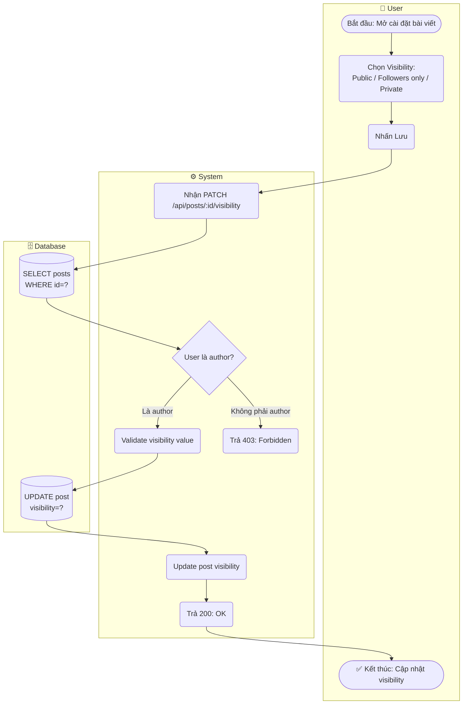
```mermaid
flowchart TD
  subgraph User ["👤 User"]
    direction TB
    U1(["Bắt đầu: Mở cài đặt bài viết"])
    U2("Chọn Visibility:<br/>Public / Followers only / Private")
    U3("Nhấn Lưu")
    U4(["✅ Kết thúc: Cập nhật visibility"])
  end

  subgraph System ["⚙️ System"]
    direction TB
    S1("Nhận PATCH /api/posts/:id/visibility")
    S2{"User là author?"}
    S3("Validate visibility value")
    S4("Update post visibility")
    S5("Trả 403: Forbidden")
    S6("Trả 200: OK")
  end

  subgraph DB ["🗄️ Database"]
    direction TB
    D1[("SELECT posts<br/>WHERE id=?")]
    D2[("UPDATE post<br/>visibility=?")]
  end

  U1 --> U2 --> U3 --> S1 --> D1
  D1 --> S2
  S2 -- "Không phải author" --> S5
  S2 -- "Là author" --> S3 --> D2 --> S4 --> S6 --> U4

  %% UC-ID: UC10
```

---

# Part 3: Discovery & Feed Flows (M3)

## 3.1 Xem News Feed — UC11

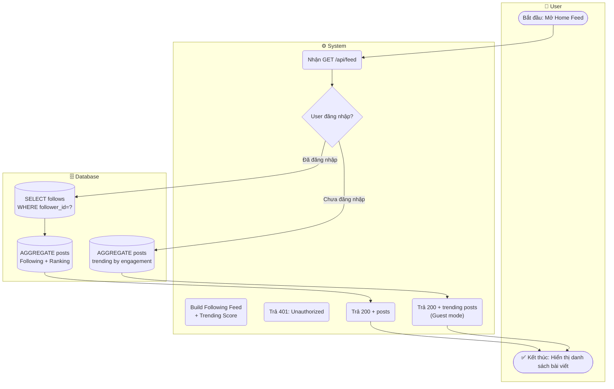
```mermaid
flowchart TD
  subgraph User ["👤 User"]
    direction TB
    U1(["Bắt đầu: Mở Home Feed"])
    U2(["✅ Kết thúc: Hiển thị danh sách bài viết"])
  end

  subgraph System ["⚙️ System"]
    direction TB
    S1("Nhận GET /api/feed")
    S2{"User đăng nhập?"}
    S3("Build Following Feed<br/>+ Trending Score")
    S4("Trả 401: Unauthorized")
    S5("Trả 200 + posts")
    S6("Trả 200 + trending posts<br/>(Guest mode)")
  end

  subgraph DB ["🗄️ Database"]
    direction TB
    D1[("SELECT follows<br/>WHERE follower_id=?")]
    D2[("AGGREGATE posts<br/>Following + Ranking")]
    D3[("AGGREGATE posts<br/>trending by engagement")]
  end

  U1 --> S1 --> S2
  S2 -- "Chưa đăng nhập" --> D3 --> S6 --> U2
  S2 -- "Đã đăng nhập" --> D1 --> D2 --> S5 --> U2

  %% UC-ID: UC11
```

## 3.2 Tìm kiếm nội dung/người dùng — UC12

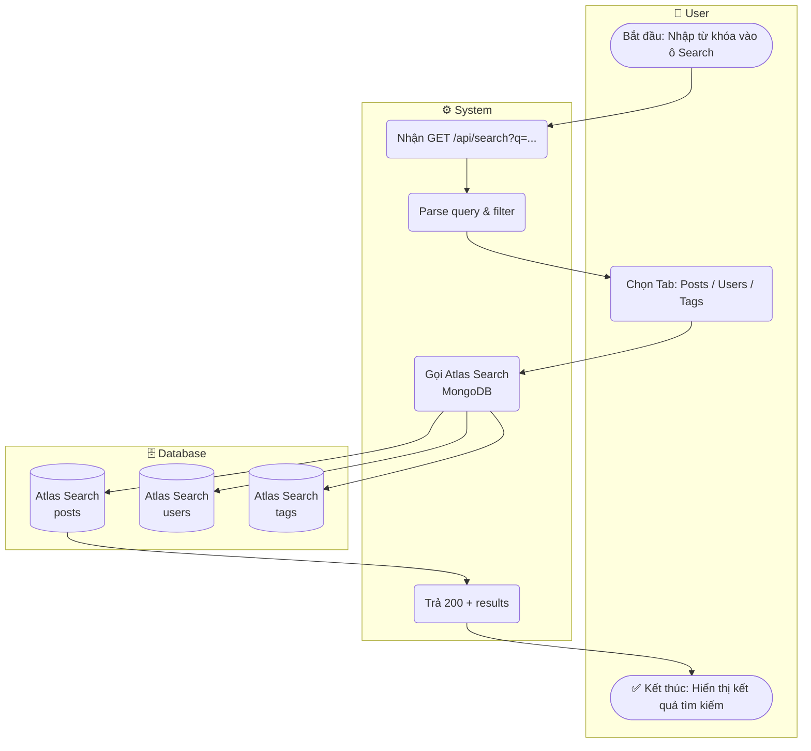
```mermaid
flowchart TD
  subgraph User ["👤 User"]
    direction TB
    U1(["Bắt đầu: Nhập từ khóa vào ô Search"])
    U2("Chọn Tab: Posts / Users / Tags")
    U3(["✅ Kết thúc: Hiển thị kết quả tìm kiếm"])
  end

  subgraph System ["⚙️ System"]
    direction TB
    S1("Nhận GET /api/search?q=...")
    S2("Parse query & filter")
    S3("Gọi Atlas Search<br/>MongoDB")
    S4("Trả 200 + results")
  end

  subgraph DB ["🗄️ Database"]
    direction TB
    D1[("Atlas Search<br/>posts")]
    D2[("Atlas Search<br/>users")]
    D3[("Atlas Search<br/>tags")]
  end

  U1 --> S1 --> S2
  S2 --> U2
  U2 --> S3
  S3 --> D1
  D1 --> S4 --> U3
  S3 --> D2
  S3 --> D3

  %% UC-ID: UC12
```

## 3.3 Autocomplete Search — UC13

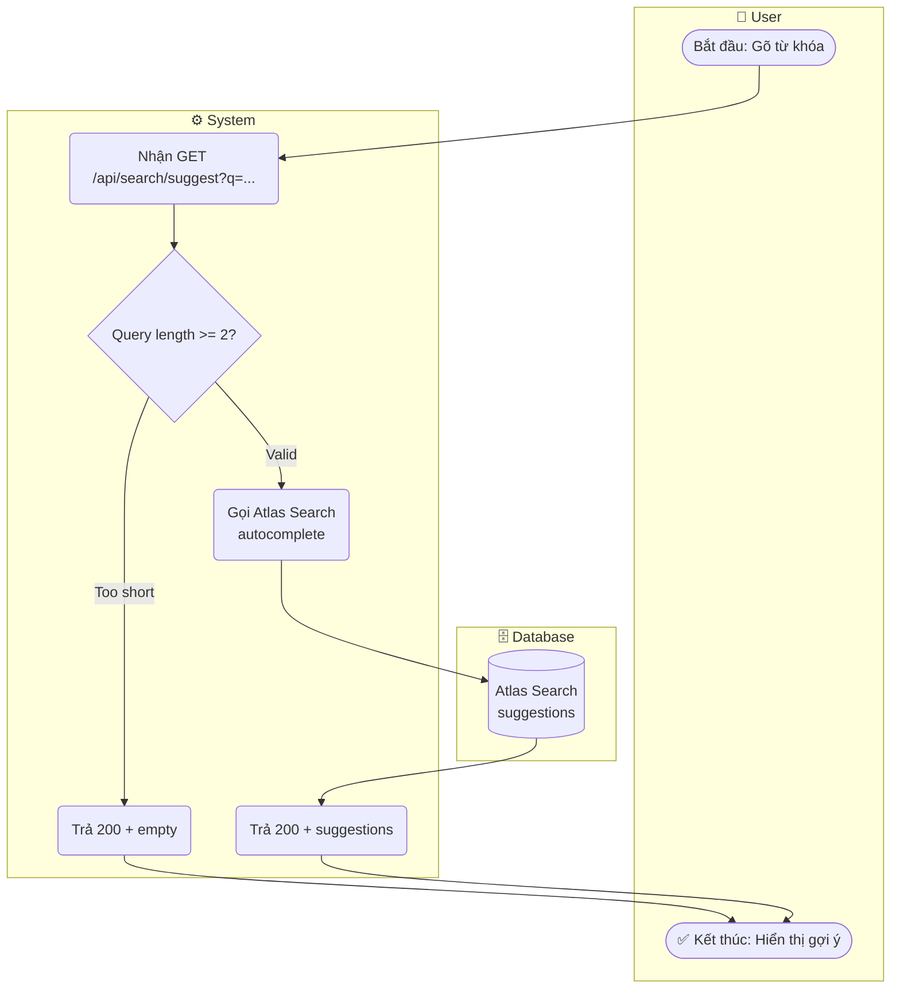
```mermaid
flowchart TD
  subgraph User ["👤 User"]
    direction TB
    U1(["Bắt đầu: Gõ từ khóa"])
    U2(["✅ Kết thúc: Hiển thị gợi ý"])
  end

  subgraph System ["⚙️ System"]
    direction TB
    S1("Nhận GET /api/search/suggest?q=...")
    S2{"Query length >= 2?"}
    S3("Gọi Atlas Search<br/>autocomplete")
    S4("Trả 200 + suggestions")
    S5("Trả 200 + empty")
  end

  subgraph DB ["🗄️ Database"]
    direction TB
    D1[("Atlas Search<br/>suggestions")]
  end

  U1 --> S1 --> S2
  S2 -- "Too short" --> S5 --> U2
  S2 -- "Valid" --> S3 --> D1 --> S4 --> U2

  %% UC-ID: UC13
```

---

# Part 4: Engagement & Connections Flows (M4)

## 4.1 Like/Unlike bài viết — UC14

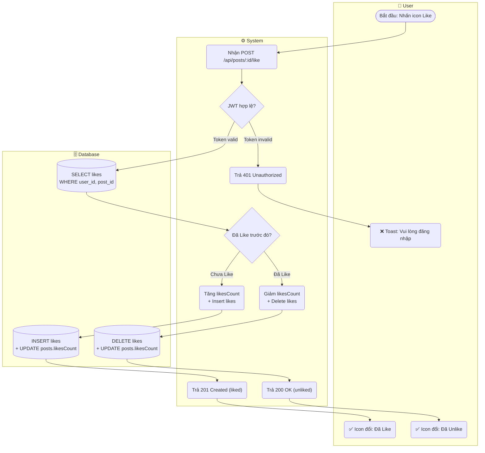
```mermaid
flowchart TD
  subgraph User ["👤 User"]
    direction TB
    U1(["Bắt đầu: Nhấn icon Like"])
    U2("✅ Icon đổi: Đã Like")
    U3("✅ Icon đổi: Đã Unlike")
    U4("❌ Toast: Vui lòng đăng nhập")
  end

  subgraph System ["⚙️ System"]
    direction TB
    S1("Nhận POST /api/posts/:id/like")
    S2{"JWT hợp lệ?"}
    S3{"Đã Like trước đó?"}
    S4("Tăng likesCount<br/>+ Insert likes")
    S5("Giảm likesCount<br/>+ Delete likes")
    S6("Trả 401 Unauthorized")
    S7("Trả 201 Created (liked)")
    S8("Trả 200 OK (unliked)")
  end

  subgraph DB ["🗄️ Database"]
    direction TB
    D1[("SELECT likes<br/>WHERE user_id, post_id")]
    D2[("INSERT likes<br/>+ UPDATE posts.likesCount")]
    D3[("DELETE likes<br/>+ UPDATE posts.likesCount")]
  end

  U1 --> S1 --> S2
  S2 -- "Token invalid" --> S6 --> U4
  S2 -- "Token valid" --> D1
  D1 --> S3
  S3 -- "Chưa Like" --> S4 --> D2 --> S7 --> U2
  S3 -- "Đã Like" --> S5 --> D3 --> S8 --> U3

  %% UC-ID: UC14
```

## 4.2 Bình luận và phản hồi lồng nhau — UC15

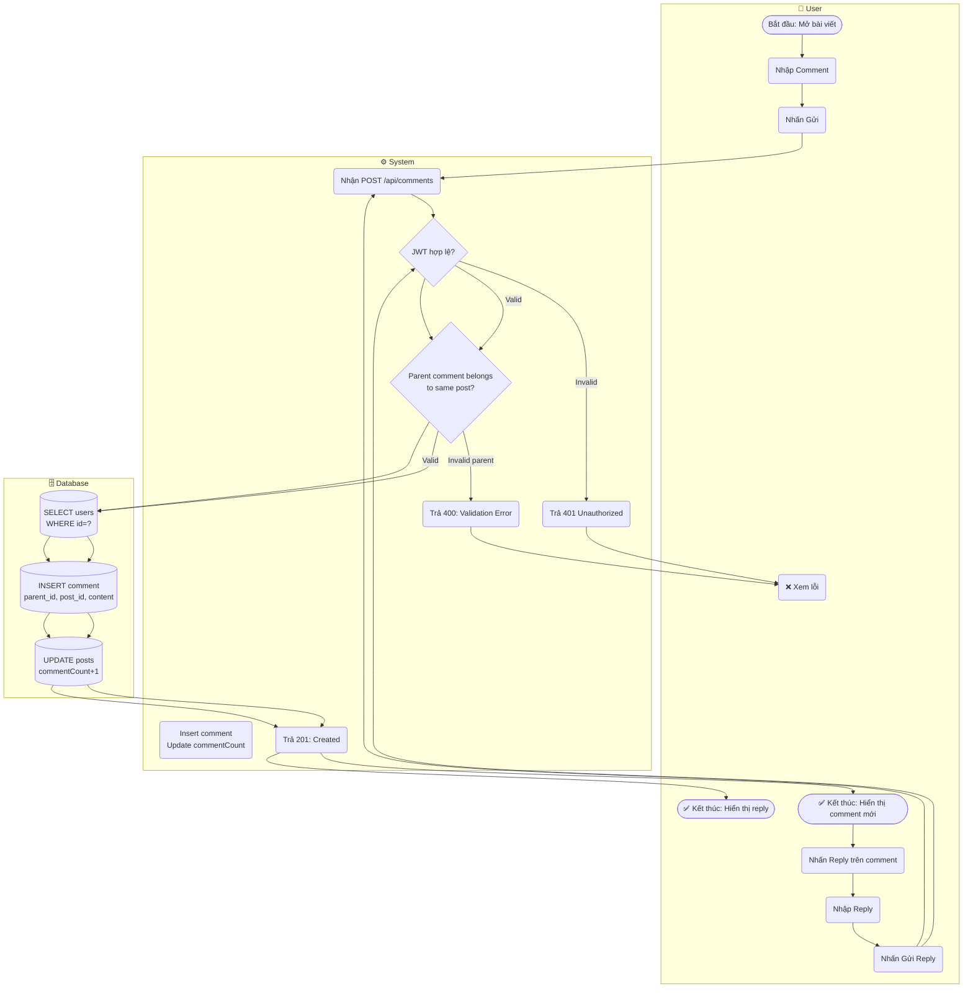
```mermaid
flowchart TD
  subgraph User ["👤 User"]
    direction TB
    U1(["Bắt đầu: Mở bài viết"])
    U2("Nhập Comment")
    U3("Nhấn Gửi")
    U4("❌ Xem lỗi")
    U5(["✅ Kết thúc: Hiển thị comment mới"])
    U6("Nhấn Reply trên comment")
    U7("Nhập Reply")
    U8("Nhấn Gửi Reply")
    U9(["✅ Kết thúc: Hiển thị reply"])
  end

  subgraph System ["⚙️ System"]
    direction TB
    S1("Nhận POST /api/comments")
    S2{"JWT hợp lệ?"}
    S3{"Parent comment belongs<br/>to same post?"}
    S4("Insert comment<br/>Update commentCount")
    S5("Trả 401 Unauthorized")
    S6("Trả 400: Validation Error")
    S7("Trả 201: Created")
  end

  subgraph DB ["🗄️ Database"]
    direction TB
    D1[("SELECT users<br/>WHERE id=?")]
    D2[("INSERT comment<br/>parent_id, post_id, content")]
    D3[("UPDATE posts<br/>commentCount+1")]
  end

  U1 --> U2 --> U3 --> S1 --> S2
  S2 -- "Invalid" --> S5 --> U4
  S2 -- "Valid" --> S3
  S3 -- "Invalid parent" --> S6 --> U4
  S3 -- "Valid" --> D1 --> D2 --> D3 --> S7 --> U5

  U5 --> U6 --> U7 --> U8 --> S1
  U8 --> S2 --> S3 --> D1 --> D2 --> D3 --> S7 --> U9

  %% UC-ID: UC15
```

## 4.3 Chia sẻ bài viết — UC16

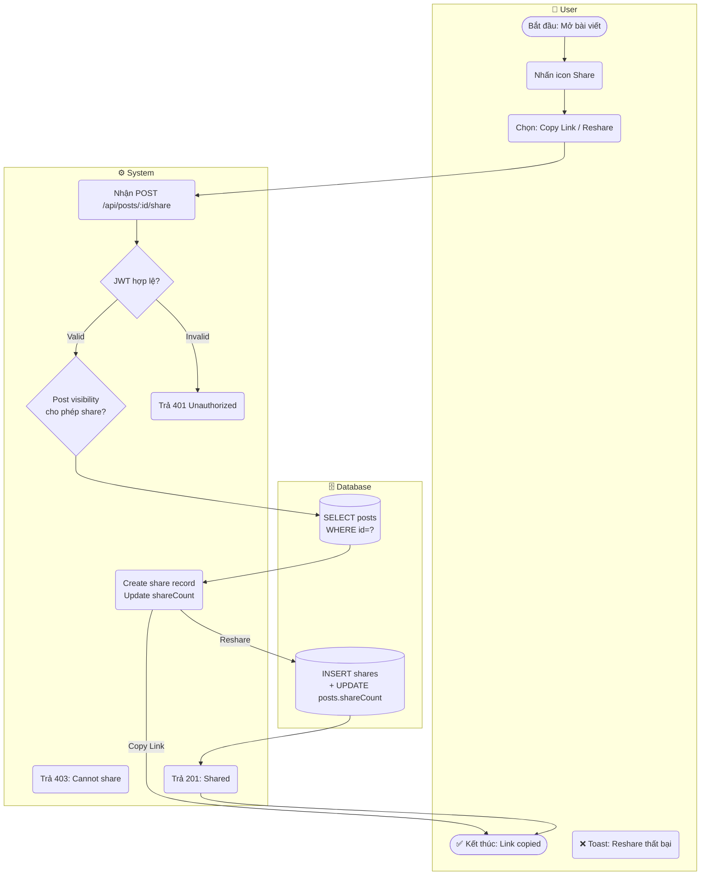
```mermaid
flowchart TD
  subgraph User ["👤 User"]
    direction TB
    U1(["Bắt đầu: Mở bài viết"])
    U2("Nhấn icon Share")
    U3("Chọn: Copy Link / Reshare")
    U4(["✅ Kết thúc: Link copied"])
    U5("❌ Toast: Reshare thất bại")
  end

  subgraph System ["⚙️ System"]
    direction TB
    S1("Nhận POST /api/posts/:id/share")
    S2{"JWT hợp lệ?"}
    S3{"Post visibility<br/>cho phép share?"}
    S4("Create share record<br/>Update shareCount")
    S5("Trả 401 Unauthorized")
    S6("Trả 403: Cannot share")
    S7("Trả 201: Shared")
  end

  subgraph DB ["🗄️ Database"]
    direction TB
    D1[("SELECT posts<br/>WHERE id=?")]
    D2[("INSERT shares<br/>+ UPDATE posts.shareCount")]
  end

  U1 --> U2 --> U3 --> S1 --> S2
  S2 -- "Invalid" --> S5
  S2 -- "Valid" --> S3 --> D1
  D1 --> S4
  S4 -- "Copy Link" --> U4
  S4 -- "Reshare" --> D2 --> S7 --> U4

  %% UC-ID: UC16
```

## 4.4 Follow/Unfollow thành viên — UC17

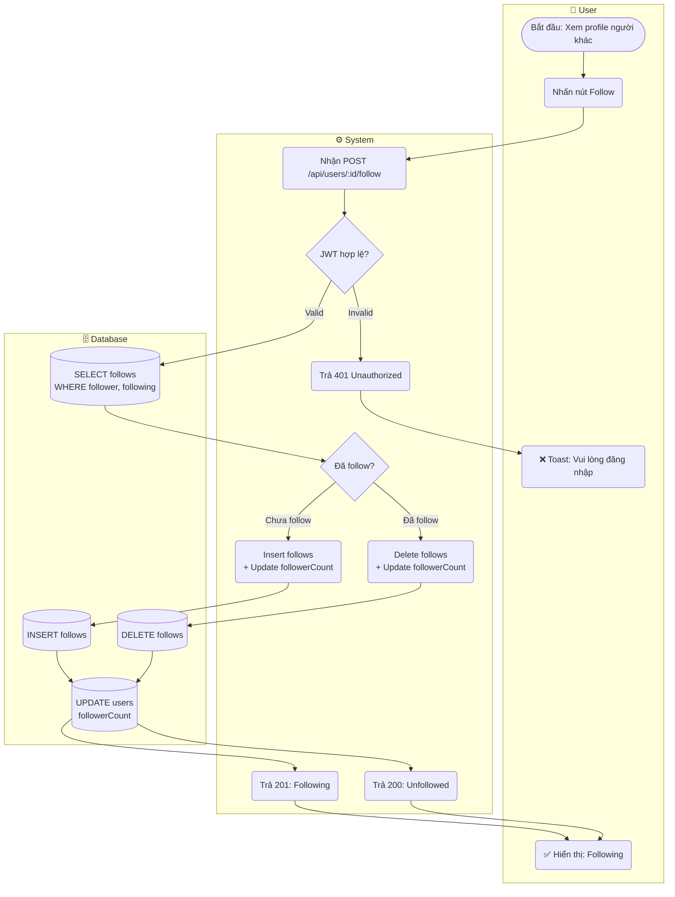
```mermaid
flowchart TD
  subgraph User ["👤 User"]
    direction TB
    U1(["Bắt đầu: Xem profile người khác"])
    U2("Nhấn nút Follow")
    U3("✅ Hiển thị: Following")
    U4("❌ Toast: Vui lòng đăng nhập")
  end

  subgraph System ["⚙️ System"]
    direction TB
    S1("Nhận POST /api/users/:id/follow")
    S2{"JWT hợp lệ?"}
    S3{"Đã follow?"}
    S4("Insert follows<br/>+ Update followerCount")
    S5("Delete follows<br/>+ Update followerCount")
    S6("Trả 401 Unauthorized")
    S7("Trả 201: Following")
    S8("Trả 200: Unfollowed")
  end

  subgraph DB ["🗄️ Database"]
    direction TB
    D1[("SELECT follows<br/>WHERE follower, following")]
    D2[("INSERT follows")]
    D3[("DELETE follows")]
    D4[("UPDATE users<br/>followerCount")]
  end

  U1 --> U2 --> S1 --> S2
  S2 -- "Invalid" --> S6 --> U4
  S2 -- "Valid" --> D1
  D1 --> S3
  S3 -- "Chưa follow" --> S4 --> D2 --> D4 --> S7 --> U3
  S3 -- "Đã follow" --> S5 --> D3 --> D4 --> S8 --> U3

  %% UC-ID: UC17
```

## 4.5 Block người dùng — UC18

```mermaid
flowchart TD
  subgraph User ["👤 User"]
    direction TB
    U1(["Bắt đầu: Xem profile người dùng"])
    U2("Nhấn Block")
    U3("Xác nhận Block")
    U4("✅ Hiển thị: Blocked")
    U5("❌ Toast: Block thất bại")
  end

  subgraph System ["⚙️ System"]
    direction TB
    S1("Nhận POST /api/users/:id/block")
    S2{"JWT hợp lệ?"}
    S3{"Target user<br/>is not self?"}
    S4("Insert blocks<br/>+ Delete follows")]
    S5("Trả 401 Unauthorized")
    S6("Trả 400: Cannot block self")
    S7("Trả 201: Blocked")
  end

  subgraph DB ["🗄️ Database"]
    direction TB
    D1[("SELECT users<br/>WHERE id=?")]
    D2[("INSERT blocks<br/>DELETE follows (both ways)")]
  end

  U1 --> U2 --> U3 --> S1 --> S2
  S2 -- "Invalid" --> S5
  S2 -- "Valid" --> S3 --> D1
  D1 --> S4 --> D2 --> S7 --> U4

  %% UC-ID: UC18
```

---

# Part 5: Bookmarking Flows (M5)

## 5.1 Lưu/Bỏ lưu bài viết — UC19

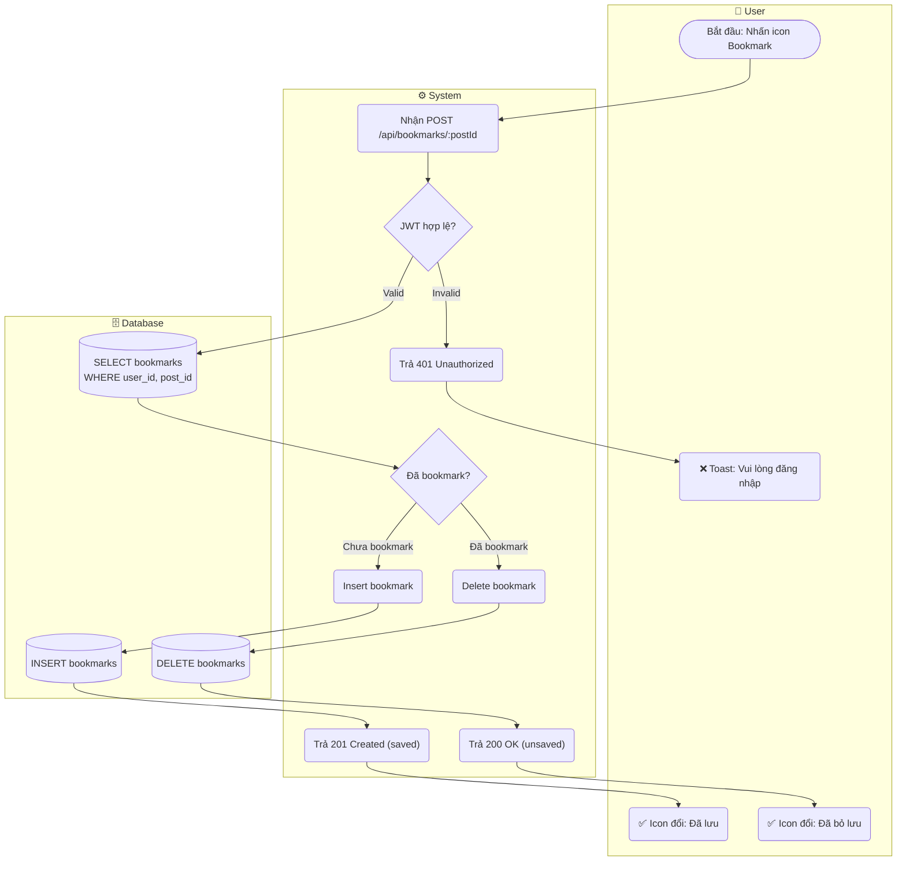
```mermaid
flowchart TD
  subgraph User ["👤 User"]
    direction TB
    U1(["Bắt đầu: Nhấn icon Bookmark"])
    U2("✅ Icon đổi: Đã lưu")
    U3("✅ Icon đổi: Đã bỏ lưu")
    U4("❌ Toast: Vui lòng đăng nhập")
  end

  subgraph System ["⚙️ System"]
    direction TB
    S1("Nhận POST /api/bookmarks/:postId")
    S2{"JWT hợp lệ?"}
    S3{"Đã bookmark?"}
    S4("Insert bookmark")
    S5("Delete bookmark")
    S6("Trả 401 Unauthorized")
    S7("Trả 201 Created (saved)")
    S8("Trả 200 OK (unsaved)")
  end

  subgraph DB ["🗄️ Database"]
    direction TB
    D1[("SELECT bookmarks<br/>WHERE user_id, post_id")]
    D2[("INSERT bookmarks")]
    D3[("DELETE bookmarks")]
  end

  U1 --> S1 --> S2
  S2 -- "Invalid" --> S6 --> U4
  S2 -- "Valid" --> D1
  D1 --> S3
  S3 -- "Chưa bookmark" --> S4 --> D2 --> S7 --> U2
  S3 -- "Đã bookmark" --> S5 --> D3 --> S8 --> U3

  %% UC-ID: UC19
```

## 5.2 Quản lý Collection Bookmark — UC20

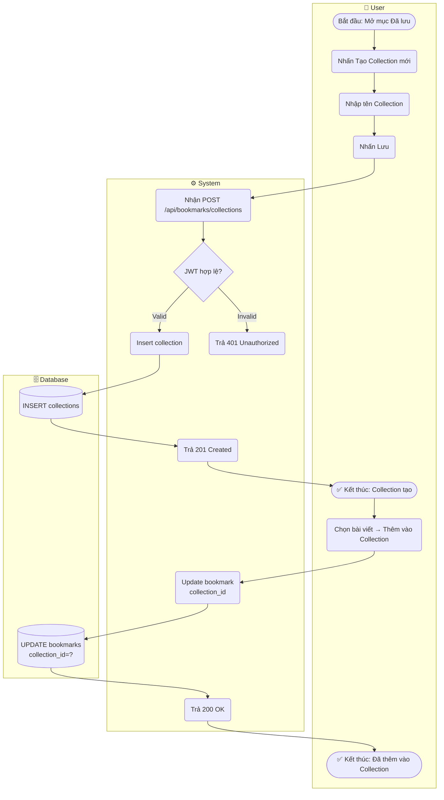
```mermaid
flowchart TD
  subgraph User ["👤 User"]
    direction TB
    U1(["Bắt đầu: Mở mục Đã lưu"])
    U2("Nhấn Tạo Collection mới")
    U3("Nhập tên Collection")
    U4("Nhấn Lưu")
    U5(["✅ Kết thúc: Collection tạo"])
    U6("Chọn bài viết → Thêm vào Collection")
    U7(["✅ Kết thúc: Đã thêm vào Collection"])
  end

  subgraph System ["⚙️ System"]
    direction TB
    S1("Nhận POST /api/bookmarks/collections")
    S2{"JWT hợp lệ?"}
    S3("Insert collection")
    S4("Update bookmark<br/>collection_id")
    S5("Trả 401 Unauthorized")
    S6("Trả 201 Created")
    S7("Trả 200 OK")
  end

  subgraph DB ["🗄️ Database"]
    direction TB
    D1[("INSERT collections")]
    D2[("UPDATE bookmarks<br/>collection_id=?")]
  end

  U1 --> U2 --> U3 --> U4 --> S1 --> S2
  S2 -- "Invalid" --> S5
  S2 -- "Valid" --> S3 --> D1 --> S6 --> U5

  U5 --> U6 --> S4 --> D2 --> S7 --> U7

  %% UC-ID: UC20
```

---

# Part 6: Notification & Moderation Flows (M6)

## 6.1 Nhận thông báo realtime (SSE) — UC21

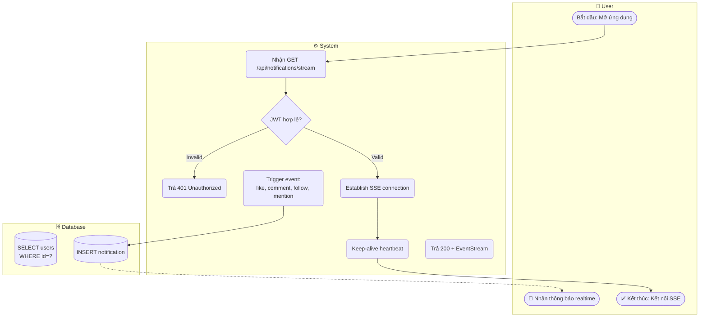
```mermaid
flowchart TD
  subgraph User ["👤 User"]
    direction TB
    U1(["Bắt đầu: Mở ứng dụng"])
    U2(["✅ Kết thúc: Kết nối SSE"])
    U3(["🔔 Nhận thông báo realtime"])
  end

  subgraph System ["⚙️ System"]
    direction TB
    S1("Nhận GET /api/notifications/stream")
    S2{"JWT hợp lệ?"}
    S3("Establish SSE connection")
    S4("Keep-alive heartbeat")
    S5("Trigger event:<br/>like, comment, follow, mention")
    S6("Trả 401 Unauthorized")
    S7("Trả 200 + EventStream")
  end

  subgraph DB ["🗄️ Database"]
    direction TB
    D1[("SELECT users<br/>WHERE id=?")]
    D2[("INSERT notification")]
  end

  U1 --> S1 --> S2
  S2 -- "Invalid" --> S6
  S2 -- "Valid" --> S3 --> S4 --> U2

  S5 --> D2
  D2 -.-> U3

  %% UC-ID: UC21
```

## 6.2 Đánh dấu đã đọc thông báo — UC22

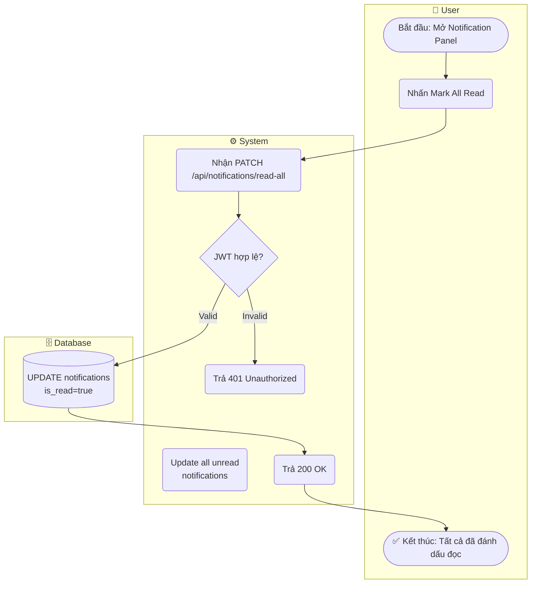
```mermaid
flowchart TD
  subgraph User ["👤 User"]
    direction TB
    U1(["Bắt đầu: Mở Notification Panel"])
    U2("Nhấn Mark All Read")
    U3(["✅ Kết thúc: Tất cả đã đánh dấu đọc"])
  end

  subgraph System ["⚙️ System"]
    direction TB
    S1("Nhận PATCH /api/notifications/read-all")
    S2{"JWT hợp lệ?"}
    S3("Update all unread<br/>notifications")
    S4("Trả 401 Unauthorized")
    S5("Trả 200 OK")
  end

  subgraph DB ["🗄️ Database"]
    direction TB
    D1[("UPDATE notifications<br/>is_read=true")]
  end

  U1 --> U2 --> S1 --> S2
  S2 -- "Invalid" --> S4
  S2 -- "Valid" --> D1 --> S5 --> U3

  %% UC-ID: UC22
```

## 6.3 Báo cáo vi phạm — UC23

```mermaid
flowchart TD
  subgraph User ["👤 User"]
    direction TB
    U1(["Bắt đầu: Mở bài viết/Comment"])
    U2("Nhấn Report")
    U3("Chọn lý do: Spam, Abuse, Other")
    U4("Nhập mô tả (tùy chọn)")
    U5("Nhấn Gửi báo cáo")
    U6(["✅ Kết thúc: Báo cáo đã gửi"])
  end

  subgraph System ["⚙️ System"]
    direction TB
    S1("Nhận POST /api/reports")
    S2{"JWT hợp lệ?"}
    S3("Validate report data")
    S4("Insert report<br/>+ Auto-approve check")
    S5("Trả 401 Unauthorized")
    S6("Trả 201: Report submitted")
  end

  subgraph DB ["🗄️ Database"]
    direction TB
    D1[("INSERT reports")]
    D2[("UPDATE post/comment<br/>status=reported")]
  end

  U1 --> U2 --> U3 --> U4 --> U5 --> S1 --> S2
  S2 -- "Invalid" --> S5
  S2 -- "Valid" --> S3 --> D1 --> D2 --> S6 --> U6

  %% UC-ID: UC23
```

## 6.4 Kiểm duyệt / Xem xét báo cáo — UC24

```mermaid
flowchart TD
  subgraph User ["👤 User (Admin)"]
    direction TB
    U1(["Bắt đầu: Mở Admin Dashboard"])
    U2("Xem danh sách báo cáo")
    U3("Chọn báo cáo để xem chi tiết")
    U4("Chọn hành động: Approve / Reject / Ban")
    U5(["✅ Kết thúc: Xử lý hoàn tất"])
  end

  subgraph System ["⚙️ System"]
    direction TB
    S1("Nhận GET /api/admin/reports")
    S2{"User is Admin?"}
    S3("Nhận PATCH /api/admin/reports/:id")
    S4{"Action: Approve?"}
    S5{"Action: Ban user?"}
    S6("Update report status<br/>Update content status")
    S7("Ban user account")
    S8("Trả 403: Forbidden")
    S9("Trả 200 OK")
  end

  subgraph DB ["🗄️ Database"]
    direction TB
    D1[("SELECT reports<br/>WHERE status=pending")]
    D2[("UPDATE reports<br/>status=resolved")]
    D3[("UPDATE posts<br/>status=hidden")]
    D4[("UPDATE users<br/>status=banned")]
  end

  U1 --> S1 --> S2
  S2 -- "Not Admin" --> S8
  S2 -- "Admin" --> D1 --> U2 --> U3 --> S3 --> S4 --> S6 --> D2 --> D3 --> S9 --> U5
  S4 --> S5 --> D4 --> S9 --> U5

  %% UC-ID: UC24
```

---

# Part 7: Profile & Account Flows (M1 - Phần mở rộng)

## 7.1 Quản lý hồ sơ cá nhân — UC06

```mermaid
flowchart TD
  subgraph User ["👤 User"]
    direction TB
    U1(["Bắt đầu: Mở Settings"])
    U2("Chỉnh sửa: Avatar, Bio, Links")
    U3("Nhấn Lưu thay đổi")
    U4(["✅ Kết thúc: Cập nhật thành công"])
  end

  subgraph System ["⚙️ System"]
    direction TB
    S1("Nhận PATCH /api/users/profile")
    S2{"JWT hợp lệ?"}
    S3("Validate input<br/>Process avatar upload")
    S4("Update user profile")
    S5("Trả 401 Unauthorized")
    S6("Trả 200 OK")
  end

  subgraph DB ["🗄️ Database"]
    direction TB
    D1[("UPDATE users<br/>avatar, bio, links")]
  end

  U1 --> U2 --> U3 --> S1 --> S2
  S2 -- "Invalid" --> S5
  S2 -- "Valid" --> S3 --> D1 --> S6 --> U4

  %% UC-ID: UC06
```

## 7.2 Xem hồ sơ công khai — UC07

```mermaid
flowchart TD
  subgraph User ["👤 User"]
    direction TB
    U1(["Bắt đầu: Click vào username"])
    U2(["✅ Kết thúc: Hiển thị profile"])
  end

  subgraph System ["⚙️ System"]
    direction TB
    S1("Nhận GET /api/users/:username")
    S2{"User exists?"}
    S3{"Viewer is blocked<br/>by target?"}
    S4("Get user profile<br/>+ Recent posts")
    S5("Trả 404: Not found")
    S6("Trả 403: Blocked")
    S7("Trả 200 + profile")
  end

  subgraph DB ["🗄️ Database"]
    direction TB
    D1[("SELECT users<br/>WHERE username=?")]
    D2[("SELECT blocks<br/>WHERE blocker=?")]
    D3[("SELECT posts<br/>WHERE author=?")]
  end

  U1 --> S1 --> D1
  D1 --> S2
  S2 -- "Not found" --> S5
  S2 -- "Found" --> D2
  D2 --> S3
  S3 -- "Blocked" --> S6 --> U2
  S3 -- "Not blocked" --> S4 --> D3 --> S7 --> U2

  %% UC-ID: UC07
```

---

## Tổng hợp Use Cases

| STT | Use Case | UC-ID | Module |
|-----|----------|-------|--------|
| 1 | Đăng ký tài khoản | UC01 | M1 |
| 2 | Đăng nhập Email/Password | UC02 | M1 |
| 3 | Đăng nhập OAuth (Google) | UC03 | M1 |
| 4 | Đăng xuất | UC04 | M1 |
| 5 | Quên mật khẩu / Reset Password | UC05 | M1 |
| 6 | Quản lý hồ sơ cá nhân | UC06 | M1 |
| 7 | Xem hồ sơ công khai | UC07 | M1 |
| 8 | Tạo bài viết | UC08 | M2 |
| 9 | Chỉnh sửa/Xóa bài viết | UC09 | M2 |
| 10 | Thiết lập quyền riêng tư | UC10 | M2 |
| 11 | Xem News Feed | UC11 | M3 |
| 12 | Tìm kiếm nội dung/người dùng | UC12 | M3 |
| 13 | Autocomplete Search | UC13 | M3 |
| 14 | Like/Unlike bài viết | UC14 | M4 |
| 15 | Bình luận và phản hồi lồng nhau | UC15 | M4 |
| 16 | Chia sẻ bài viết | UC16 | M4 |
| 17 | Follow/Unfollow thành viên | UC17 | M4 |
| 18 | Block người dùng | UC18 | M4 |
| 19 | Lưu/Bỏ lưu bài viết | UC19 | M5 |
| 20 | Quản lý Collection Bookmark | UC20 | M5 |
| 21 | Nhận thông báo realtime (SSE) | UC21 | M6 |
| 22 | Đánh dấu đã đọc thông báo | UC22 | M6 |
| 23 | Báo cáo vi phạm | UC23 | M6 |
| 24 | Kiểm duyệt / Xem xét báo cáo | UC24 | M6 |

---

## ⚠️ Assumptions

1. **JWT Validation**: Tất cả API có `{}` decision đều assume JWT được validate ở middleware trước khi vào handler.
2. **Error Handling**: Các error paths (401, 403, 404, 500) được minh họa simplified — production code cần chi tiết hơn.
3. **Rich Text**: Post creation assume Rich Text đã được parse ở frontend, backend chỉ nhận HTML/JSON.
4. **Media Upload**: Media upload được xử lý riêng (local storage hoặc Vercel Blob) — không thể hiện chi tiết trong flow.
5. **SSE**: Notification realtime sử dụng Server-Sent Events, không phải WebSocket.
6. **Search**: MongoDB Atlas Search được dùng cho full-text search và autocomplete.

---

*Document generated from feature-map-and-priority.md — 2026-03-01*
