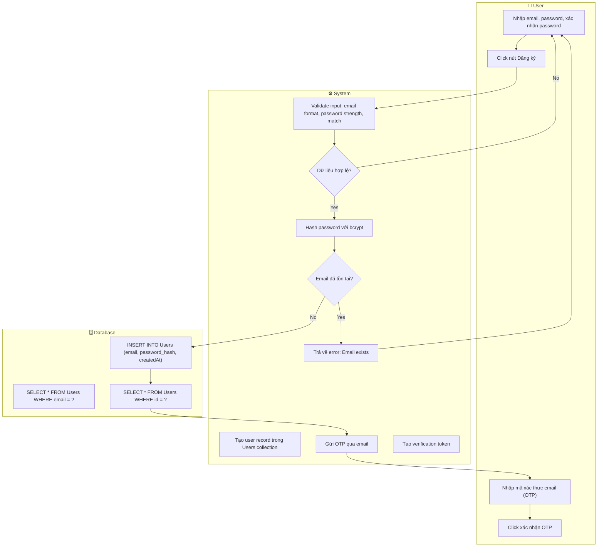
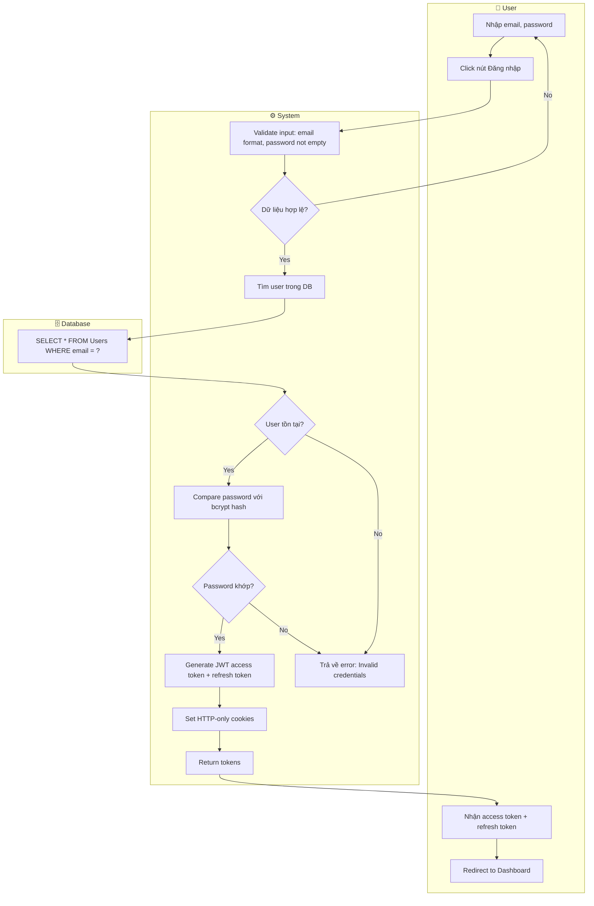
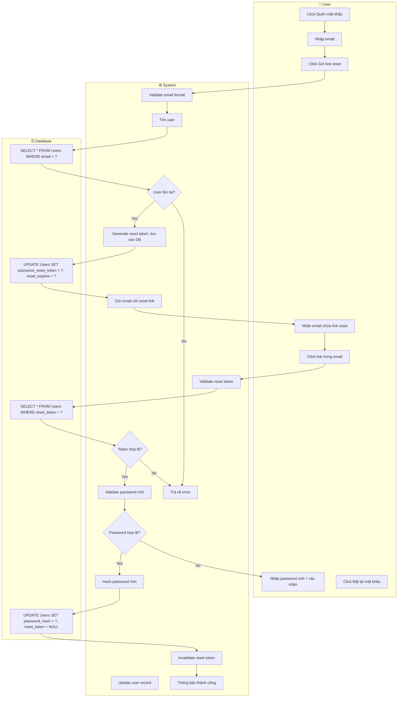
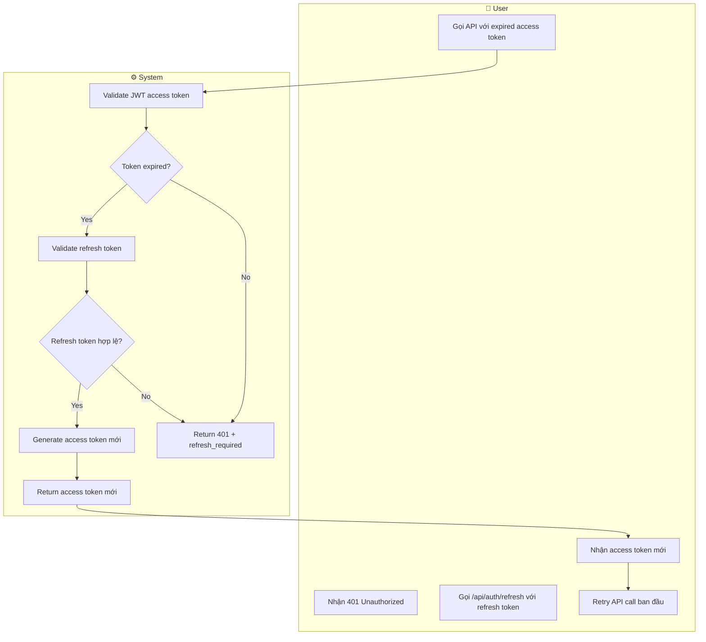

# Flow Diagram — User Authentication (Đăng ký & Đăng nhập)

> **Module:** M1 — Authentication & Profile
> **Source:** feature-map-and-priority.md, requirements-srs.md
> **Format:** Mermaid Flowchart (3-Lane Swimlane)

---

## Flow 1: User Registration

---

## Flow 2: User Login

---

## Flow 3: Password Reset

---

## Flow 4: Token Refresh

---

## Assumptions

| # | Assumption | Source |
|---|------------|--------|
| 1 | Password hash dùng bcrypt với cost factor 12 | industry standard |
| 2 | JWT access token expires trong 15 phút | security best practice |
| 3 | Refresh token expires trong 7 ngày | common practice |
| 4 | OTP verification dùng 6-digit code, expires trong 5 phút | common 2FA pattern |
| 5 | Reset token là UUID v4, expires trong 1 giờ | common reset flow |

---

## UC-IDs Referenced

| UC-ID | Use Case |
|-------|----------|
| UC-101 | User Registration |
| UC-102 | User Login |
| UC-103 | Password Reset |
| UC-104 | Token Refresh |

---

*Generated: 2026-03-01*
