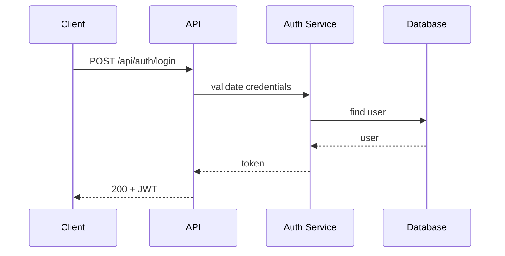
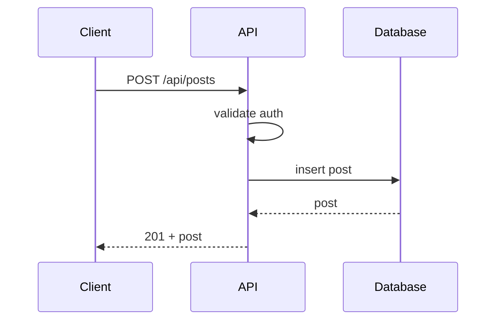

# Sequence Diagrams

> **Mục đích:** Mô tả flow chi tiết cho từng use case  
> **Format:** Mermaid sequenceDiagram  
> **Ghi chú:** Có thể tách thành nhiều file trong thư mục này (auth-flow.md, post-creation.md, feed-load.md)  

---

## Authentication Flow

## Post Creation Flow

<!-- Thêm: News Feed Load, Bookmark Save -->
