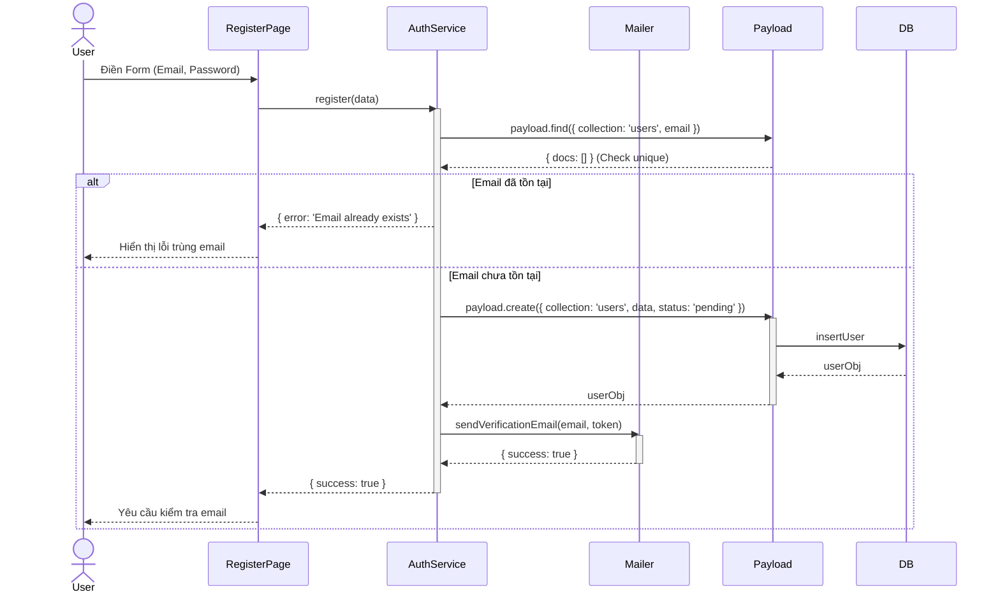
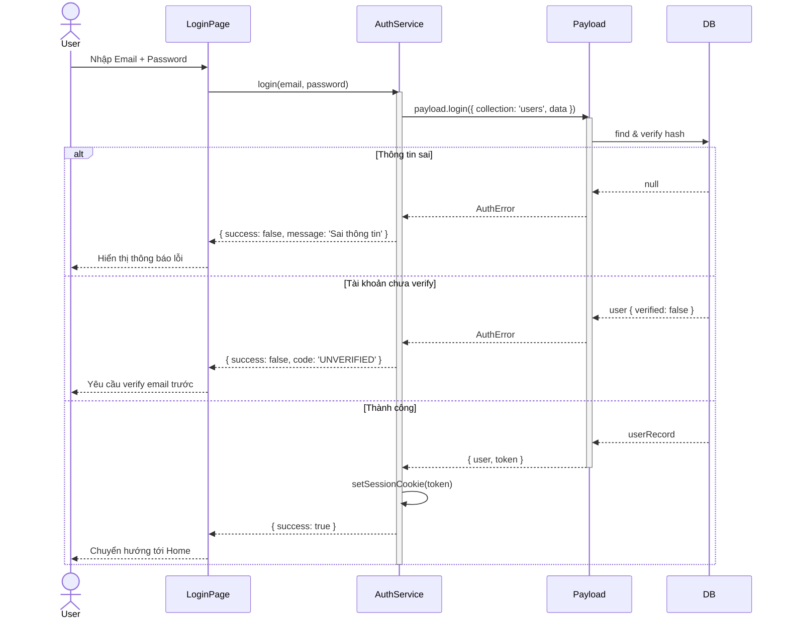
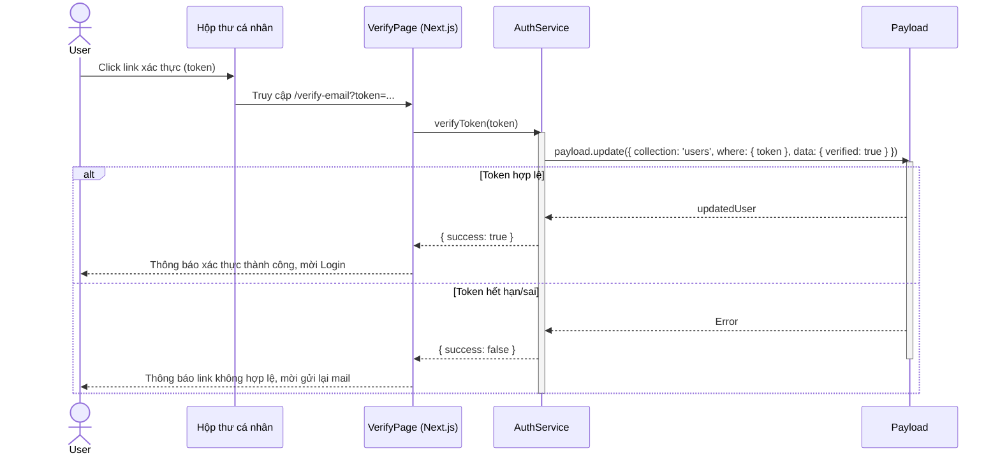
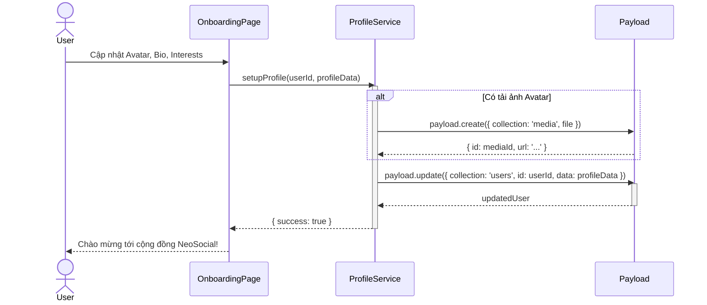

# Sequence Diagram: M1 - Auth & Profile

> **Module:** Identity Foundation
> **Mục tiêu:** Mô tả chi tiết các kịch bản xác thực và quản lý định danh người dùng.

---

## 📋 1. Kịch bản: Đăng ký tài khoản (M1-A1)

---

## 🔐 2. Kịch bản: Đăng nhập nội bộ (M1-A2)

---

## 📧 3. Kịch bản: Xác thực Email (M1-A3)

---

## 🛠️ 4. Kịch bản: Onboarding Setup (M1-A5)

---
*Ghi chú từ Tít dễ thương: Luồng Auth này đảm bảo tính bảo mật cao và trải nghiệm người dùng mượt mà ngay từ bước đầu tiên.* 🥰
