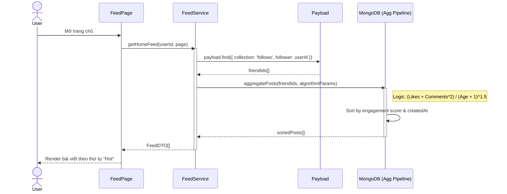
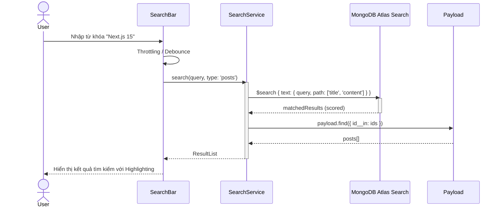
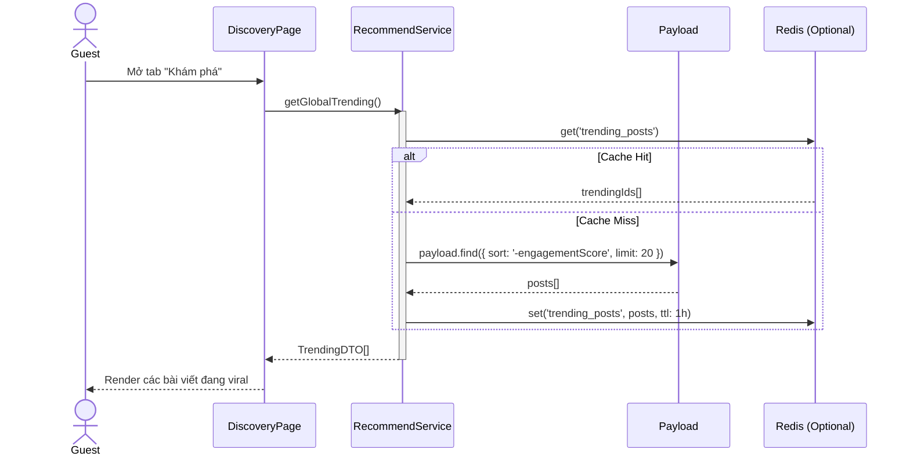

# Sequence Diagram: M3 - Discovery & Feed

> **Module:** Distribution
> **Mục tiêu:** Mô tả luồng tổng hợp dữ liệu, tìm kiếm và thuật toán xếp hạng bài viết.

---

## 🏗️ 1. Kịch bản: Tổng hợp News Feed (M3-A1)

Mô tả luồng tính toán điểm số (Ranking) dựa trên Time-decay và Engagement để hiển thị cho người dùng.

---

## 🔍 2. Kịch bản: Truy vấn Search Engine (M3-A2)

Mô tả luồng sử dụng MongoDB Atlas Search để tìm kiếm Full-text.

---

## 💡 3. Kịch bản: Gợi ý bài viết Hot (Discovery - M3-A3)

Mô tả luồng hiển thị nội dung cho người dùng mới hoặc khám phá nội dung ngoài danh sách bạn bè.

---
*Fidelity Note: Thuật toán Ranking được tích hợp trực tiếp vào Aggregation Pipeline của MongoDB để đảm bảo hiệu năng tối ưu cho MVP.* 🥰
