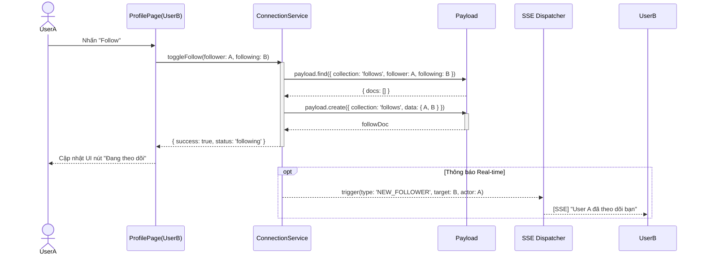
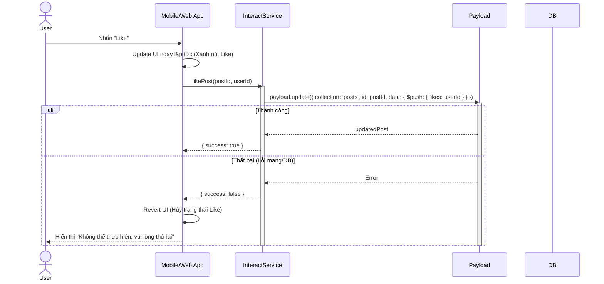
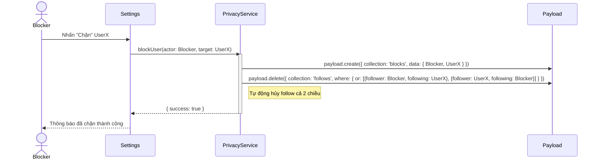

# Sequence Diagram: M4 - Engagement & Connections

> **Module:** Social
> **Mục tiêu:** Mô tả logic thiết lập mối quan hệ và các tương tác xã hội giữa người dùng.

---

## 🤝 1. Kịch bản: Friendship Handshake (Follow - M4-A1)

Mô tả luồng theo dõi người dùng khác và đồng bộ trạng thái.

---

## ❤️ 2. Kịch bản: Engagement Logic (Like bài viết - M4-A2)

Mô tả luồng tương tác cơ bản với Optimistic UI.

---

## 🛡️ 3. Kịch bản: Connection Privacy (Block - M4-A3)

Mô tả luồng chặn người dùng và cắt đứt tương tác.

---
*Ghi chú từ Tít dễ thương: Tương tác xã hội được thiết kế với cơ chế Optimistic UI giúp ứng dụng của yêu thương cảm thấy cực kỳ "nhạy" và mượt mà đấy!* 🥰
