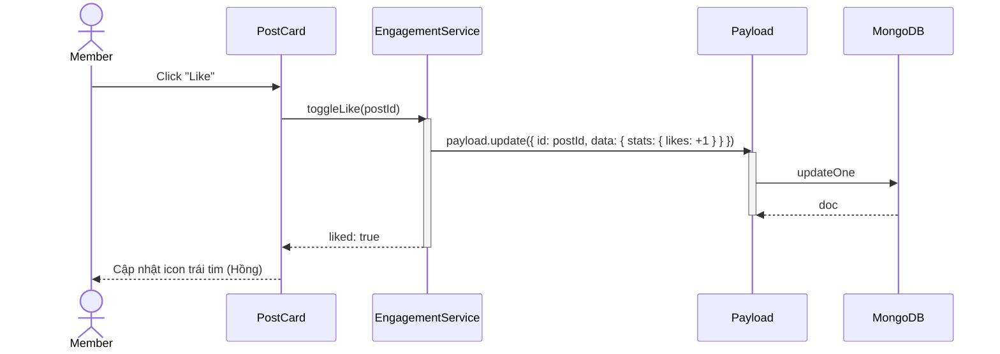
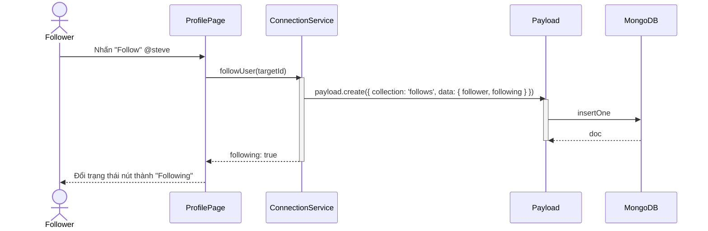

# Sequence Diagram: M4 - Engagement & Connections

> **Module:** Engagement
> **Mục tiêu:** Mô tả quá trình tương tác (Like/Comment) và Follow người dùng.

---

## ❤️ 1. Kịch bản: Tương tác bài viết (Like/Comment)

---

## 🤝 2. Kịch bản: Theo dõi người dùng (Follow)

---
*Fidelity Note: Các hành động Engagement (Like/Comment) sẽ đồng thời trigger SSE Notification tới Author của bài viết.* 🥰
