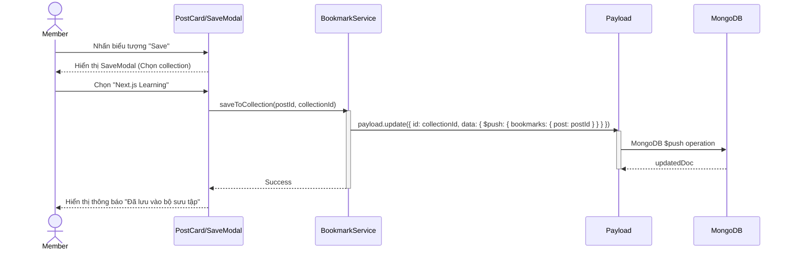
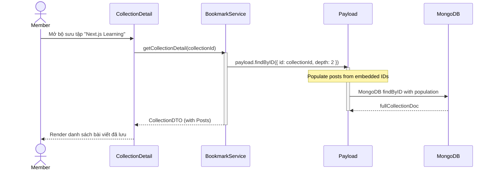

# Sequence Diagram: M5 - Social Bookmarking

> **Module:** Social Bookmarking
> **Mục tiêu:** Mô tả quá trình lưu bài viết vào bộ sưu tập cá nhân.

---

## 💾 1. Kịch bản: Lưu bài viết vào Collection

Mô tả luồng từ khi người dùng bấm Save đến khi bài viết được nhúng (Embedded) vào document Collection.

---

## 📂 2. Kịch bản: Xem danh sách bài viết trong Collection

Mô tả luồng truy vấn và Populate dữ liệu bài viết từ mảng nhúng.

---
*Fidelity Note: Sử dụng chiến lược Embedded Bookmarks giúp giảm số lượng collection cần quản lý và tối ưu tốc độ đọc của Member.* 🥰
