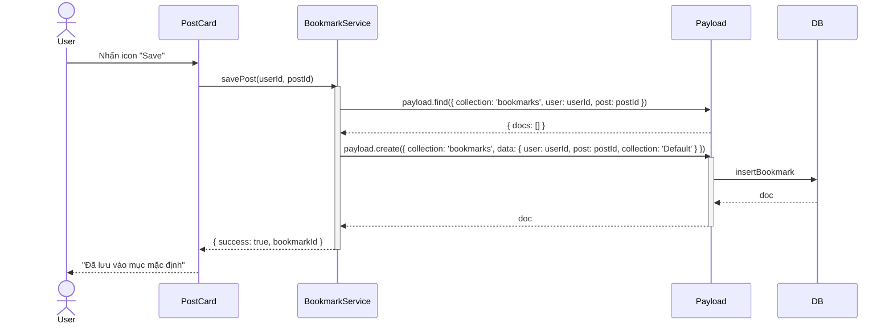
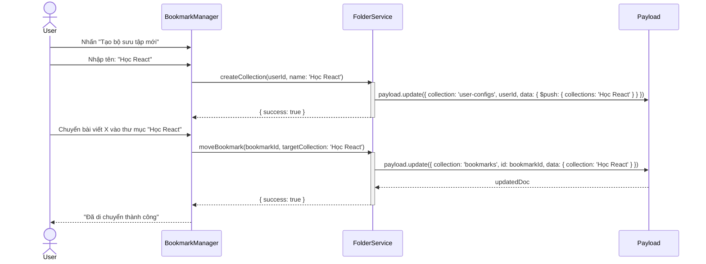

# Sequence Diagram: M5 - Bookmarking

> **Module:** Knowledge Management
> **Mục tiêu:** Mô tả luồng lưu trữ bài viết và quản lý các thư mục kiến trúc kiến thức cá nhân.

---

## 💾 1. Kịch bản: Bookmark Persistence (Lưu bài viết - M5-A1)

Mô tả luồng lưu một bài viết vào mục mặc định.

---

## 📂 2. Kịch bản: Collection Orchestrator (Quản lý thư mục - M5-A2)

Mô tả luồng tạo thư mục mới và di chuyển bookmark vào đó.

---
*Fidelity Note: Tính năng Bookmarking là một trong những USP (Unique Selling Point) của dự án, được thiết kế để giúp người dùng quản lý kiến thức hiệu quả.* 🥰
