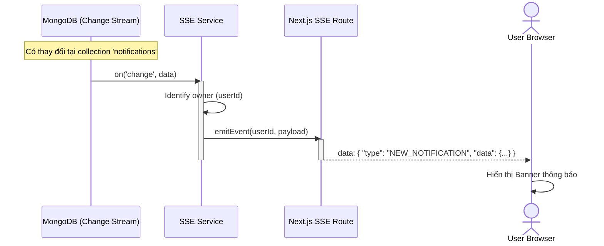
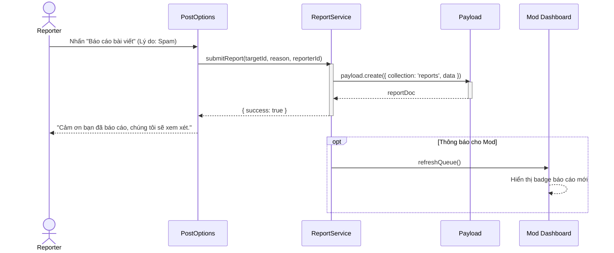
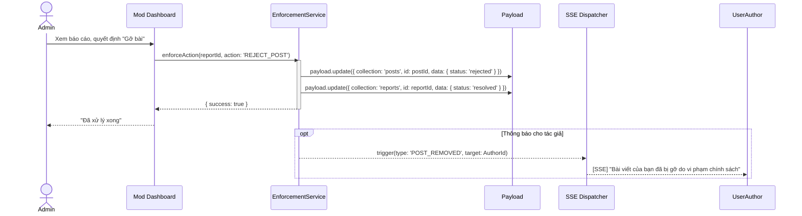

# Sequence Diagram: M6 - Notifications & Moderation

> **Module:** Safety & Engagement
> **Mục tiêu:** Mô tả chi tiết luồng đẩy thông báo thời gian thực và quản lý báo cáo vi phạm.

---

## 📡 1. Kịch bản: SSE Event Dispatcher (M6-A1)

Mô tả kỹ thuật cách một sự kiện từ Database kích hoạt thông báo Real-time.

---

## 🚩 2. Kịch bản: Content Report Pipeline (M6-A2)

Mô tả luồng từ khi người dùng báo cáo đến khi vào hàng chờ xử lý của Admin.

---

## 🔨 3. Kịch bản: Enforcement Action (Admin thực thi - M6-A3)

Mô tả luồng Admin xử lý vi phạm bài viết.

---
*Ghi chú từ Tít dễ thương: Module Safety giúp bảo vệ cộng đồng NeoSocial của chúng mình luôn văn minh và tích cực đấy yêu thương ạ!* 🥰
