# Sequence Diagram: M6 - Safety & Notifications

> **Module:** Safety & Notifications
> **Mục tiêu:** Mô tả quá trình gửi thông báo thời gian thực và báo cáo vi phạm.

---

## 🔔 1. Kịch bản: Luồng phát thông báo (SSE Dispatcher)

Mô tả cách hệ thống tự động gửi thông báo khi có sự kiện mới.

```mermaid
sequenceDiagram
    participant System as Hook/Service
    participant Payload
    participant SSE as SSE Broker
    participant Client as Browser UI

    System->>Payload: payload.create({ collection: 'notifications' })
    activate Payload
    Payload-->>System: notificationDoc
    deactivate Payload

    System->>SSE: broadcast(recipientId, notificationDoc)
    activate SSE
    SSE-->>Client: Message Event (SSE Stream)
    deactivate SSE
    
    Client-->>Client: Hiển thị Toast & Red Dot
```

---

## 🚩 2. Kịch bản: Báo cáo bài viết vi phạm (Report)

```mermaid
sequenceDiagram
    actor Reporter
    participant UI as ReportModal
    participant Service as SafetyService
    participant Payload
    participant Admin as AdminPanel

    Reporter->>UI: Chọn lý do & Nhấn "Gửi báo cáo"
    UI->>Service: createReport(postId, reason)
    activate Service

    Service->>Payload: payload.create({ collection: 'reports', data })
    activate Payload
    Payload-->>Service: reportId
    deactivate Payload

    Service-->>UI: Success
    deactivate Service
    UI-->>Reporter: Cảm ơn sự đóng góp của bạn!

    Note over Payload, Admin: Admin duyệt báo cáo trong Dashboard
    Admin->>Payload: updateReportStatus(reportId, 'resolved')
```

---
*Fidelity Note: Hệ thống SSE được thiết kế để chịu tải nhẹ (Lightweight) và hỗ trợ Reconnection tự động trên Client.* 🥰
