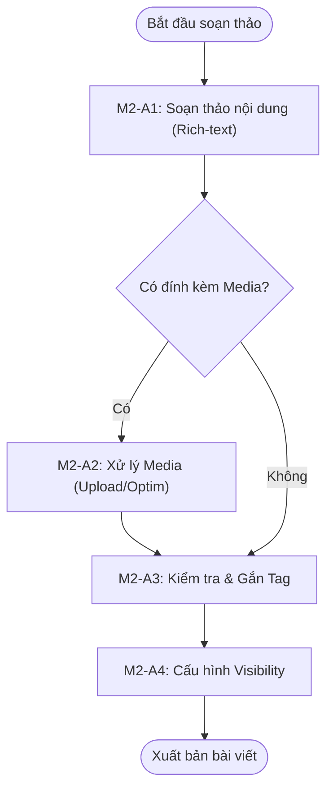

```mermaid
flowchart TD
    %% Nodes
    Start(["Bắt đầu soạn thảo"])
    A1["M2-A1: Soạn thảo nội dung (Rich-text)"]
    A2{"Có đính kèm Media?"}
    A3["M2-A2: Xử lý Media (Upload/Optim)"]
    A4["M2-A3: Kiểm tra & Gắn Tag"]
    A5["M2-A4: Cấu hình Visibility"]
    End(["Xuất bản bài viết"])

    %% Flow
    Start --> A1
    A1 --> A2
    A2 -- "Có" --> A3
    A3 --> A4
    A2 -- "Không" --> A4
    A4 --> A5
    A5 --> End
```