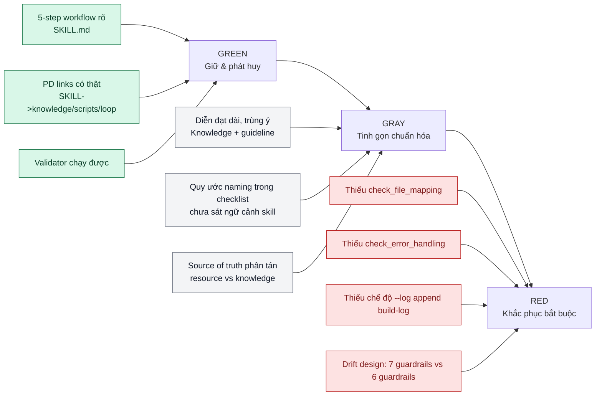

# Đánh Giá Sâu Bộ Agent Skill `skill-builder`

Ngày đánh giá: **2026-02-14**  
Phạm vi: `.agent/skills/skill-builder` + toàn bộ context trong `.skill-context/skill-builder` + tài liệu nền (`guiline.md`, `architect.md`, `.skill-context/DESIGN.md`) + benchmark web từ Anthropic.

---

## 1. Cách tiếp cận đánh giá

1. Đọc `guiline.md` trước để lấy khung chuẩn (7 Zones, 5-step lifecycle, gatekeeper, validation).
2. Đối chiếu 3 lớp tài liệu:
- Lớp thiết kế/kế hoạch: `.skill-context/skill-builder/design.md`, `.skill-context/skill-builder/todo.md`.
- Lớp resource/spec: `.skill-context/skill-builder/resources/build-guidelines.md`, `.skill-context/skill-builder/resources/validation-logic.md`.
- Lớp implementation thực tế: `.agent/skills/skill-builder/*`.
3. Benchmark chéo với best practices của Anthropic về Agent Skills.
4. Khoanh vùng theo 3 mức:
- **Điểm sáng (Giữ & phát huy)**
- **Điểm thừa (Tinh gọn)**
- **Vùng tối (Khắc phục ngay)**

---

## 2. Snapshot nhanh theo vùng

| Vùng | Điểm tổng quan | Trạng thái |
|---|---:|---|
| Core (`SKILL.md`) | 7.8/10 | Tốt, nhưng lệch nhẹ so với spec thiết kế |
| Knowledge (`knowledge/`) | 7.2/10 | Giàu nội dung, nhưng còn trùng lặp và nặng |
| Scripts (`validate_skill.py`) | 5.4/10 | Chạy được, nhưng thiếu các gate quan trọng đã đặc tả |
| Loop (`build-checklist.md`, `build-log.md`) | 6.1/10 | Có khung, nhưng traceability chưa khép kín |
| Context (`design/todo/resources/log`) | 6.6/10 | Khung rất tốt, nhưng có drift giữa kế hoạch và hiện thực |

Kết quả chạy script thực tế:
- `python3 .agent/skills/skill-builder/scripts/validate_skill.py .agent/skills/skill-builder` trả về `FINAL STATUS: PASS`.
- `SKILL.md` dài 70 dòng (đúng ngưỡng).
- Placeholder đếm được: 3.

---

## 3. Lược đồ khoanh vùng ưu tiên



---

## 4. Đánh giá chi tiết từng vùng

## 4.1 Core Zone — `SKILL.md`

### Điểm sáng cần giữ
- Workflow 5 bước rõ và bám đúng luồng PREPARE → CLARIFY → BUILD → VERIFY → DELIVER tại `.agent/skills/skill-builder/SKILL.md:17`, `.agent/skills/skill-builder/SKILL.md:25`, `.agent/skills/skill-builder/SKILL.md:31`, `.agent/skills/skill-builder/SKILL.md:38`, `.agent/skills/skill-builder/SKILL.md:48`.
- Có cơ chế chống hallucination bằng source grounding và placeholder gate tại `.agent/skills/skill-builder/SKILL.md:35` và `.agent/skills/skill-builder/SKILL.md:61`.
- Có nguyên tắc dừng lỗi rõ (`Log-Notify-Stop`) tại `.agent/skills/skill-builder/SKILL.md:60` và `.agent/skills/skill-builder/SKILL.md:67`.

### Điểm thừa cần tinh gọn
- Phần mission còn hơi tuyên ngôn dài, có thể rút ngắn để tiết kiệm context tokens tại `.agent/skills/skill-builder/SKILL.md:9`.
- Dùng placeholder biến `{name}` trong path nhưng chưa nói rõ cách xác định giá trị `{name}` tại `.agent/skills/skill-builder/SKILL.md:20`.

### Vùng tối cần khắc phục
- Drift với thiết kế: design nói **7 guardrails** tại `.skill-context/skill-builder/design.md:112` và `.skill-context/skill-builder/design.md:144`, nhưng implementation chỉ có G1..G6 tại `.agent/skills/skill-builder/SKILL.md:58`-`.agent/skills/skill-builder/SKILL.md:63`.
- Mục Clarifications được yêu cầu ghi vào design (`§Clarifications`) tại `.agent/skills/skill-builder/SKILL.md:29`, nhưng design vẫn để placeholder chưa có cơ chế đóng vòng rõ tại `.skill-context/skill-builder/design.md:261`.

---

## 4.2 Knowledge Zone — `knowledge/architect.md`, `knowledge/build-guidelines.md`

### Điểm sáng cần giữ
- Tạo được “khung tư duy chuẩn” tách khỏi core, phù hợp Progressive Disclosure.
- `build-guidelines.md` có rule rõ cho độ dài, PD, placeholder, checklist tại `.agent/skills/skill-builder/knowledge/build-guidelines.md:20`, `.agent/skills/skill-builder/knowledge/build-guidelines.md:30`, `.agent/skills/skill-builder/knowledge/build-guidelines.md:41`, `.agent/skills/skill-builder/knowledge/build-guidelines.md:67`.

### Điểm thừa cần tinh gọn
- `architect.md` rất dài và bao quát rộng, có nhiều phần “framework tổng quát” không bắt buộc cho runtime của `skill-builder`; token-cost có thể cao tại `.agent/skills/skill-builder/knowledge/architect.md:1`.
- Trùng lặp nội dung giữa resource context và knowledge runtime (ví dụ build-guidelines giống nhau ở 2 nơi), làm khó quản trị version.

### Vùng tối cần khắc phục
- Chính guideline yêu cầu “mọi file knowledge cần header Usage” tại `.agent/skills/skill-builder/knowledge/build-guidelines.md:61`, nhưng `knowledge/architect.md` không có header Usage tương ứng ngay đầu file tại `.agent/skills/skill-builder/knowledge/architect.md:1`.

---

## 4.3 Scripts Zone — `scripts/validate_skill.py`

### Điểm sáng cần giữ
- Có validator thực thi được và tạo cổng kiểm tra tự động (structure, SKILL length/keywords, PD links, placeholder) tại `.agent/skills/skill-builder/scripts/validate_skill.py:18`, `.agent/skills/skill-builder/scripts/validate_skill.py:37`, `.agent/skills/skill-builder/scripts/validate_skill.py:58`, `.agent/skills/skill-builder/scripts/validate_skill.py:87`.

### Điểm thừa cần tinh gọn
- Regex kiểm tra link theo tên file (`{filename}`) thay vì path đầy đủ, dễ false-positive khi trùng tên file khác thư mục tại `.agent/skills/skill-builder/scripts/validate_skill.py:76`.

### Vùng tối cần khắc phục
- Thiếu `check_file_mapping` dù spec bắt buộc tại `.skill-context/skill-builder/resources/validation-logic.md:42`.
- Thiếu `check_error_handling` dù todo nói đã làm tại `.skill-context/skill-builder/todo.md:40` và spec mô tả tại `.skill-context/skill-builder/resources/validation-logic.md:64`.
- Thiếu chế độ `--log` append vào build-log theo spec tại `.skill-context/skill-builder/resources/validation-logic.md:91`.
- Kiểm tra PD chưa quét nested folders đầy đủ do điều kiện `rel_root in ["knowledge", "scripts", "loop"]` tại `.agent/skills/skill-builder/scripts/validate_skill.py:69`.

Đánh giá mức độ: **P0 (phải sửa trước khi coi validator là gatekeeper đáng tin cậy)**.

---

## 4.4 Loop Zone — `loop/build-checklist.md`, `loop/build-log.md`

### Điểm sáng cần giữ
- Checklist chia 4 trục đúng chuẩn measurable/verifiable tại `.agent/skills/skill-builder/loop/build-checklist.md:3`, `.agent/skills/skill-builder/loop/build-checklist.md:8`, `.agent/skills/skill-builder/loop/build-checklist.md:13`, `.agent/skills/skill-builder/loop/build-checklist.md:18`.

### Điểm thừa cần tinh gọn
- Rule naming “CamelCase cho Component, kebab-case cho Service/Resource” chưa thực sự phù hợp cho loại artifact của một skill package tại `.agent/skills/skill-builder/loop/build-checklist.md:5`.

### Vùng tối cần khắc phục
- `loop/build-log.md` ghi Placeholder Density = 0 tại `.agent/skills/skill-builder/loop/build-log.md:29`, nhưng validator thực tế đếm 3 placeholders.
- Các dòng Validation Results dùng checkbox chưa tick dù ghi PASS tại `.agent/skills/skill-builder/loop/build-log.md:27`-`.agent/skills/skill-builder/loop/build-log.md:29`, gây mâu thuẫn trạng thái.

---

## 4.5 Context Artifacts — `design.md`, `todo.md`, `resources/*`, `.skill-context/DESIGN.md`

### Điểm sáng cần giữ
- `design.md` rất giàu cấu trúc: capability map, zone mapping, flow, risks, PD plan; chất lượng “kiến trúc trước code” tốt tại `.skill-context/skill-builder/design.md:34`, `.skill-context/skill-builder/design.md:87`, `.skill-context/skill-builder/design.md:170`, `.skill-context/skill-builder/design.md:246`.
- `todo.md` chia phase rõ, trace nguồn tốt tại `.skill-context/skill-builder/todo.md:19`.
- Bộ resources đã có đủ 2 tài liệu nền cần thiết.

### Điểm thừa cần tinh gọn
- Có drift giữa master design tổng (`.skill-context/DESIGN.md`) và thiết kế riêng `skill-builder`; master doc còn mô tả builder có `templates/` tại `.skill-context/DESIGN.md:134`, trong khi bản design riêng loại bỏ templates tại `.skill-context/skill-builder/design.md:115`.
- Một số guardrail trùng ý trong design (`G5`, `G6` đều nói logging) tại `.skill-context/skill-builder/design.md:83` và `.skill-context/skill-builder/design.md:84`.

### Vùng tối cần khắc phục
- `todo.md` đánh dấu done cho tính năng script chưa tồn tại thật (`check_error_handling`) tại `.skill-context/skill-builder/todo.md:40`.
- Clarifications pipeline chưa khép kín (design có placeholder, chưa có bản ghi thực tế) tại `.skill-context/skill-builder/design.md:261`.

---

## 5. Đối chiếu với best practices của Anthropic

Nguồn chuẩn tham chiếu chính:
- Anthropic Agent Skills Best Practices: https://www.anthropic.com/engineering/claude-code-best-practices
- Anthropic docs: Best practices for developing skills: https://docs.anthropic.com/en/docs/claude-code/memory#best-practices-for-developing-skills
- Anthropic docs (Agent Skills best practices page): https://platform.claude.com/docs/en/agents-and-tools/agent-skills/best-practices

| Tiêu chí từ Anthropic | Trạng thái hiện tại | Nhận định |
|---|---|---|
| Description phải nói rõ “skill làm gì” và “khi nào dùng” | Đạt một phần | Frontmatter có mô tả chức năng, nhưng trigger condition chưa thật sắc nét theo pattern “use when …” tại `.agent/skills/skill-builder/SKILL.md:3`. |
| Skill cần tập trung vào một nhiệm vụ hẹp, lặp lại | Đạt | `skill-builder` tập trung vai trò implementation cho workflow Architect→Planner→Builder. |
| Progressive Disclosure, liên kết 1 cấp từ SKILL.md | Đạt tốt | Có link trực tiếp sang knowledge/scripts/loop tại `.agent/skills/skill-builder/SKILL.md:14`, `.agent/skills/skill-builder/SKILL.md:15`, `.agent/skills/skill-builder/SKILL.md:41`, `.agent/skills/skill-builder/SKILL.md:42`. |
| Dùng script cho tác vụ quyết định, dễ sai | Đạt một phần | Đã có validator script, nhưng chưa đủ module gate theo chính spec. |
| Keep concise, tránh context bloat | Đạt một phần | Core ngắn gọn; knowledge còn khá nặng và trùng lặp. |
| Có feedback/test loop rõ | Đạt một phần | Có checklist + validator, nhưng traceability log chưa khép kín và validator chưa full-spec. |

Kết luận benchmark: **hướng đi đúng với triết lý Anthropic, nhưng thiếu độ “production reliability” ở lớp validation và đồng bộ artifact.**

---

## 6. Ma trận hành động ưu tiên

```mermaid
flowchart TD
    P0[P0 - Sửa ngay\nĐóng gap spec vs implementation] --> P1[P1 - Chuẩn hóa\nGiảm drift & giảm token]
    P1 --> P2[P2 - Nâng cấp\nKiểm thử và mở rộng]

    P0a[Implement check_file_mapping] --> P0
    P0b[Implement check_error_handling] --> P0
    P0c[Add --log append build-log] --> P0
    P0d[Đồng bộ 6/7 guardrails + todo done state] --> P0

    P1a[Thêm Usage header cho knowledge files] --> P1
    P1b[Chuẩn hóa single source of truth\n(resource vs knowledge)] --> P1
    P1c[Tinh gọn checklist rule không phù hợp] --> P1

    P2a[Thêm test cases cho validator] --> P2
    P2b[Thêm fixture để test nested paths/trùng file name] --> P2
```

---

## 7. Danh sách điểm sáng / điểm thừa / vùng tối (khoanh vùng cuối)

## 7.1 Điểm sáng (duy trì và phát huy)
- Workflow 5 bước rõ, bám lifecycle.
- Guardrails có tinh thần kỹ sư phản biện + stop-on-error.
- Progressive Disclosure áp dụng đúng hướng.
- Có validator tự động, không thuần checklist thủ công.
- Tài liệu kiến trúc và kế hoạch có chiều sâu tốt.

## 7.2 Điểm thừa (cần tinh gọn)
- Trùng lặp tài liệu giữa `resources/` và `knowledge/`.
- Một số rule checklist chưa hợp ngữ cảnh skill package.
- `architect.md` runtime quá dài so với nhu cầu thực thi thường xuyên.
- Master `.skill-context/DESIGN.md` còn chi tiết cũ gây nhiễu.

## 7.3 Vùng tối (cần sửa đổi)
- Gap nghiêm trọng giữa `validation-logic.md` và `validate_skill.py` (thiếu module chính).
- Tình trạng “done trong todo nhưng chưa code thật”.
- Trạng thái log/validation mâu thuẫn (PASS nhưng checkbox chưa tick, số placeholder lệch).
- Chưa đóng vòng Clarifications như quy định workflow.

---

## 8. Kết luận cuối

`skill-builder` hiện ở mức **khá tốt về kiến trúc và ý đồ**, nhưng mới ở mức **beta về độ tin cậy vận hành**.  
Nếu xử lý xong nhóm P0, bộ skill có thể nâng nhanh lên mức production-ready cho use-case nội bộ.

