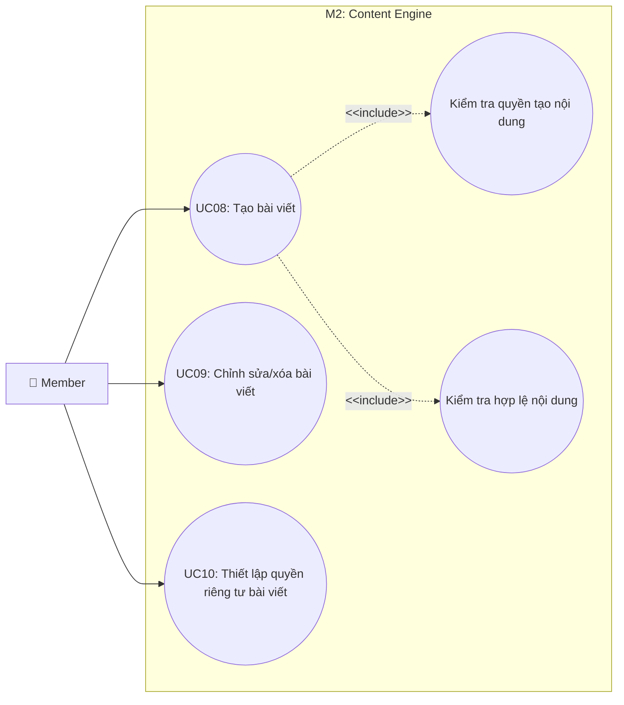

# Use Case M2: Content Engine

> [!IMPORTANT]
> **Start here:** Nếu bạn chưa xem bản tổng quát hệ thống, hãy tham khảo [UseCase Overview](./use-case-overview.md).

## 1) Phân vùng chức năng (Domain Context)
Module M2 tập trung vào vòng đời của nội dung (bài viết), từ khi khởi tạo, kiểm tra tính hợp lệ, thiết lập quyền riêng tư cho đến khi chỉnh sửa hoặc xóa bỏ.

## 2) Traceability Table

| UC | Use Case | Module | FR |
|---|---|---|---|
| UC08 | Tạo bài viết | M2.1 | FR-3 |
| UC09 | Chỉnh sửa/xóa bài viết | M2.2 | FR-3 |
| UC10 | Thiết lập quyền riêng tư bài viết | M2.2 | FR-3 |

## 3) Use Case Diagram

## 4) Cross-module Dependencies
- **M1**: Việc tạo bài viết (UC08) yêu cầu trạng thái tài khoản `Member` đã được xác thực (Auth).
- **M3**: Bài viết sau khi tạo sẽ được phân phối vào News Feed của người theo dõi (Followers). (Tham chiếu: [M3 Feed](./use-case-m3-discovery-feed.md))
- **M4**: Bài viết là đối tượng để người dùng khác Like, Comment. (Tham chiếu: [M4 Engagement](./use-case-m4-engagement-connections.md))
