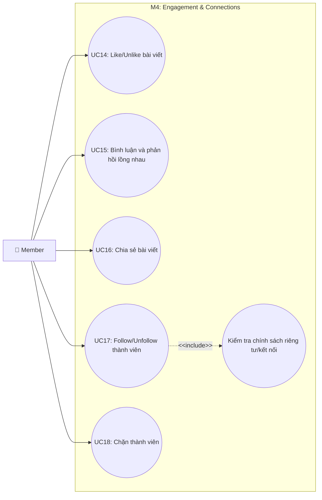

# Use Case M4: Engagement & Connections

> [!IMPORTANT]
> **Start here:** Nếu bạn chưa xem bản tổng quát hệ thống, hãy tham khảo [UseCase Overview](./use-case-overview.md).

## 1) Phân vùng chức năng (Domain Context)
Module M4 xử lý các tương tác xã hội giữa các thành viên (Engagement) và quản lý mối quan hệ/kết nối xã hội (Connections).

## 2) Traceability Table

| UC | Use Case | Module | FR |
|---|---|---|---|
| UC14 | Like/Unlike bài viết | M4.1 | FR-5 |
| UC15 | Bình luận và phản hồi lồng nhau | M4.1 | FR-5 |
| UC16 | Chia sẻ bài viết | M4.1 | FR-5 |
| UC17 | Follow/Unfollow thành viên | M4.2 | FR-10 |
| UC18 | Chặn thành viên | M4.2 | FR-10 |

## 3) Use Case Diagram

## 4) Cross-module Dependencies
- **M2**: Các hành động Like/Comment/Share (UC14, UC15, UC16) tác động lên thực thể bài viết của Module M2.
- **M3**: Hành động Follow (UC17) sẽ làm thay đổi thuật toán xếp hạng nội dung trên News Feed của người dùng. (Tham chiếu: [M3 Feed](./use-case-m3-discovery-feed.md))
- **M6**: Mỗi hành động Engagement có thể kích hoạt một thông báo realtime (Push Notification). (Tham chiếu: [M6 Notifications](./use-case-m6-notifications-moderation.md))
