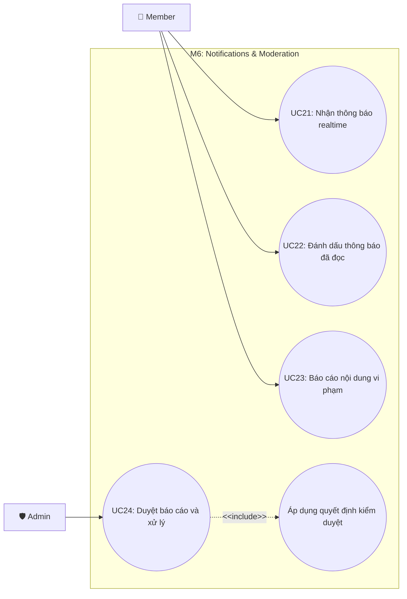

# Use Case M6: Notifications & Moderation

> [!IMPORTANT]
> **Start here:** Nếu bạn chưa xem bản tổng quát hệ thống, hãy tham khảo [UseCase Overview](./use-case-overview.md).

## 1) Phân vùng chức năng (Domain Context)
Module M6 xử lý hệ thống thông báo thời gian thực giúp duy trì tương tác người dùng và hệ thống kiểm duyệt (Moderation) để đảm bảo chất lượng nội dung và an toàn cộng đồng.

## 2) Traceability Table

| UC | Use Case | Module | FR |
|---|---|---|---|
| UC21 | Nhận thông báo realtime | M6.1 | FR-8 |
| UC22 | Đánh dấu thông báo đã đọc | M6.1 | FR-8 |
| UC23 | Báo cáo nội dung vi phạm | M6.2 | FR-9 |
| UC24 | Duyệt báo cáo và xử lý | M6.2 | FR-9 |

## 3) Use Case Diagram

## 4) Cross-module Dependencies
- **M3 & M2**: Báo cáo nội dung (UC23) thường phát sinh khi người dùng đang lướt Feed (M3) và nhìn thấy bài viết (M2) không phù hợp.
- **M4**: Các hành động như Like/Comment/Follow từ Module M4 chính là nguồn phát (trigger) tạo ra thông báo (UC21). (Tham chiếu: [M4 Engagement](./use-case-m4-engagement-connections.md))
- **M1**: Admin (UC24) có thể thực hiện khóa tài khoản (Profile status) thuộc Module M1 dựa trên kết quả kiểm duyệt.
