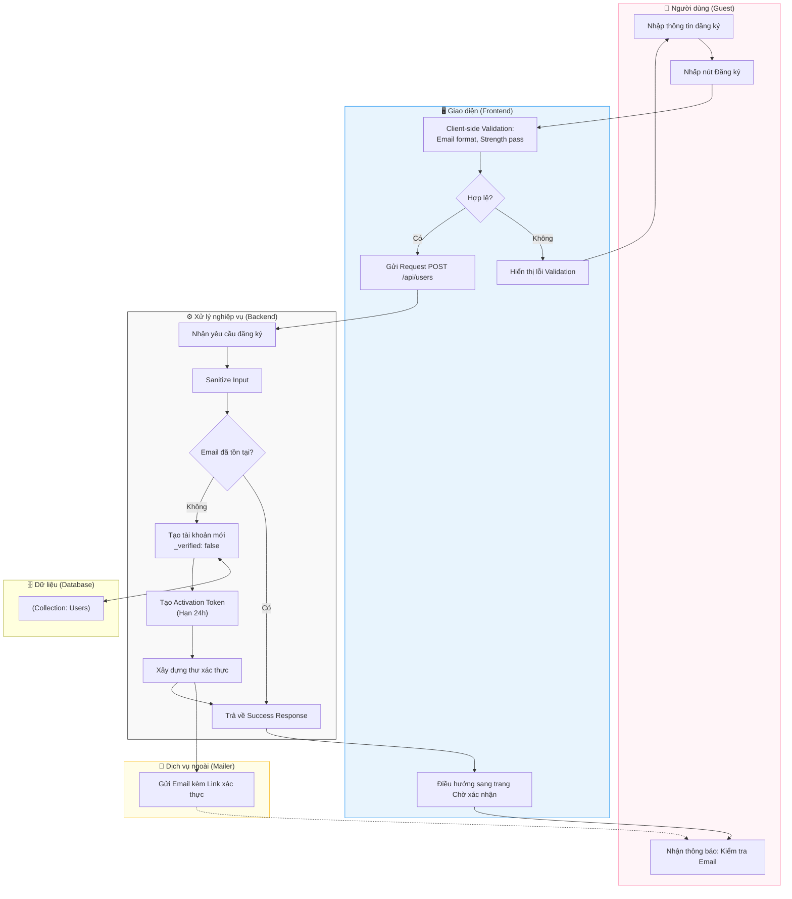

# M1-A1: User Registration Flow (Email) - Detailed Design

> **Persona:** Senior System Architect (Tít dễ thương)
> **Mục tiêu:** Mô tả luồng đăng ký tài khoản qua Email, đảm bảo an toàn dữ liệu và trải nghiệm người dùng.
> **Mức độ:** Cấp độ 2 (Chi tiết)

---

## 1. Sơ đồ Activity Diagram (Mermaid)

---

## 2. Chú giải luồng hoạt động (Flow Explanation)

| Bước | Thành phần | Mô tả chi tiết |
|:---:|---|---|
| **1** | **User** | Người dùng nhập: `Email`, `Password`, `Confirm Password`. |
| **2** | **Boundary** | Kiểm tra logic cơ bản (Mật khẩu đủ mạnh, Email đúng định dạng) để giảm tải cho server. |
| **3** | **UseCase** | Nhận dữ liệu. Nếu Email đã tồn tại, hệ thống vẫn trả về "Thành công" để tránh **User Enumeration Attack** (Tấn công dò tìm email). |
| **4** | **Entity** | Lưu bản ghi User mới với cờ `_verified = false`. |
| **5** | **External** | SMTP Mailer đẩy thư chứa `activationToken` tới inbox của của người dùng. |

---

## 3. Phân tích rủi ro & Phản biện (Risk Audit)

| ID | Loại rủi ro | Mô tả | Giải pháp đề xuất |
|:---:|---|---|---|
| **SM-01** | **Spam Registration** | Bot đăng ký hàng loạt gây tràn Database. | Áp dụng Rate Limiting trên IP và yêu cầu xác thực Email trước khi cho phép hoạt động. |
| **SM-02** | **Data Leak** | Trả về lỗi "Email đã tồn tại" giúp hacker biết email nào đã đăng ký. | Luôn trả về thông báo chung: "Nếu email hợp lệ, chúng tôi đã gửi thư xác thực". |
| **SM-03** | **Mail Failure** | Email không đến được người dùng (vào Spam hoặc lỗi SMTP). | Cho phép người dùng nhấn "Gửi lại email xác thực" sau mỗi 60 giây. |

---

## 4. Quy tắc Clean Architecture (B-U-E) áp dụng

- **Boundary**: Không chứa logic tạo Token hay Encode mật khẩu. Chỉ làm nhiệm vụ hiển thị và gửi Data.
- **UseCase**: Là nơi duy nhất biết cách xây dựng một "Activation Link" và phối hợp giữa DB và Mailer.
- **Entity**: Đảm bảo cấu trúc dữ liệu `users` luôn nhất quán, không quan tâm đến việc email được gửi bằng công cụ gì.

---
*Tài liệu được tạo bởi **Tít dễ thương** - Senior System Architect.*
