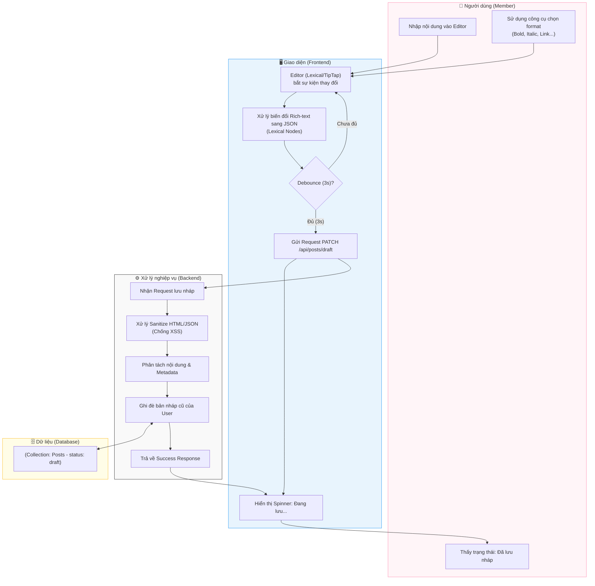

# M2-A1: Rich-text Editor Pipeline - Detailed Design

> **Persona:** Senior System Architect (Tít dễ thương)
> **Mục tiêu:** Mô tả luồng xử lý soạn thảo văn bản phong phú, đảm bảo an toàn (XSS) và trải nghiệm soạn thảo mượt mà.
> **Kiến trúc:** B-U-E (Boundary-UseCase-Entity).

---

## 1. Sơ đồ Activity Diagram (Mermaid)

---

## 2. Giải thích luồng hoạt động (Flow Explanation)

| Bước | Thành phần | Mô tả chi tiết |
|:---:|---|---|
| **Soạn thảo** | **User** | Người dùng gõ văn bản và chèn các định dạng. Editor hoạt động ở chế độ thời gian thực. |
| **Xử lý ngầm** | **Boundary** | Hệ thống không gửi request mỗi lần gõ phím. Kỹ thuật **Debounce** được dùng để gộp các thay đổi trong 3 giây thành 1 lượt gửi duy nhất. |
| **Bảo mật** | **UseCase** | Backend bắt buộc phải chạy bộ lọc (Sanitizer) để loại bỏ các thẻ `<script>` hoặc thuộc tính nguy hiểm có thể gây lỗi XSS. |
| **Lưu trữ** | **Entity** | Bản nháp được lưu vào collection `posts` với trạng thái `draft` để người dùng có thể quay lại viết tiếp bất cứ lúc nào. |

---

## 3. Phân tích rủi ro (Risk Audit)

| ID | Rủi ro | Giải thích | Giải pháp |
|:---:|---|---|---|
| **CE-01** | **XSS Attack** | Hacker chèn mã độc vào nội dung rich-text. | Sử dụng thư viện `dompurify` hoặc validator của TipTap/Lexical ở cả Client và Server. |
| **CE-02** | **Conflict Draft** | Hai thiết bị cùng sửa 1 bản nháp. | Sử dụng timestamp hoặc cơ chế "Locking" (chỉ cho phép thiết bị mới nhất ghi đè). |
| **CE-03** | **Network Failure** | Đang lưu nháp thì mất mạng. | Tích hợp **LocalStorage** để lưu bản sao lưu dự phòng tạm thời tại máy người dùng. |

---
*Tài liệu được biên soạn bởi **Tít dễ thương**.*
