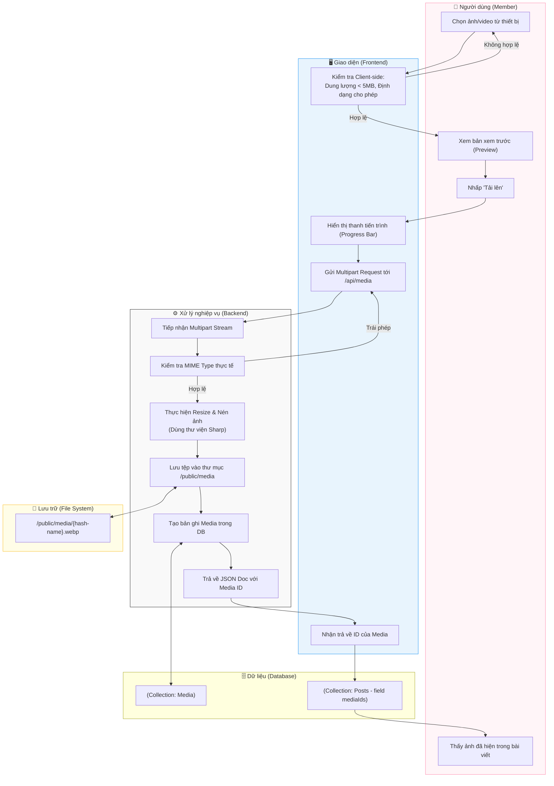

# M2-A2: Media Attachment Handler - Detailed Design

> **Persona:** Senior System Architect (Tít dễ thương)
> **Mục tiêu:** Mô tả luồng tải lên và xử lý tệp tin đa phương tiện (ảnh/video), đảm bảo tối ưu dung lượng và tính toàn vẹn của dữ liệu.
> **Kiến trúc:** B-U-E (Boundary-UseCase-Entity).

---

## 1. Sơ đồ Activity Diagram (Mermaid)

---

## 2. Giải thích luồng hoạt động (Flow Explanation)

| Bước | Thành phần | Mô tả chi tiết |
|:---:|---|---|
| **Kiểm tra đầu** | **Boundary** | Client chặn ngay các file quá nặng hoặc sai định dạng để tiết kiệm băng thông Server. |
| **Xử lý ảnh** | **UseCase** | Backend sử dụng `Sharp` để chuyển đổi ảnh sang định dạng `.webp` (tối ưu nhất cho web) và resize về các kích thước chuẩn. |
| **Lưu trữ** | **External** | Tệp tin thực tế được lưu vào hệ thống file cục bộ (Local Storage). Tên tệp được hash (SHA-256) dựa trên nội dung để tránh trùng lặp. |
| **Liên kết** | **Entity** | Sau khi có Media ID, Boundary sẽ thực hiện gắn ID này vào danh sách `attachments` của bài viết đang soạn thảo. |

---

## 3. Phân tích rủi ro (Risk Audit)

| ID | Rủi ro | Giải thích | Giải pháp |
|:---:|---|---|---|
| **MA-01** | **Storage Exhaustion** | Upload quá nhiều file rác gây đầy ổ cứng. | Áp dụng Quote giới hạn dung lượng trên mỗi User và tự động dọn dẹp các Media không được gắn vào bài viết nào sau 24h. |
| **MA-02** | **Malware Upload** | Hacker upload file thực thi giả dạng ảnh. | Kiểm tra Magic Numbers của file thay vì chỉ tin vào đuôi mở rộng (Extension). |
| **MA-03** | **Sensitive Data** | Ảnh chứa tọa độ GPS hoặc thông tin cá nhân trong EXIF. | Backend tự động xóa sạch GPS data và EXIF metadata khi xử lý ảnh. |

---
*Tài liệu được biên soạn bởi **Tít dễ thương**.*
