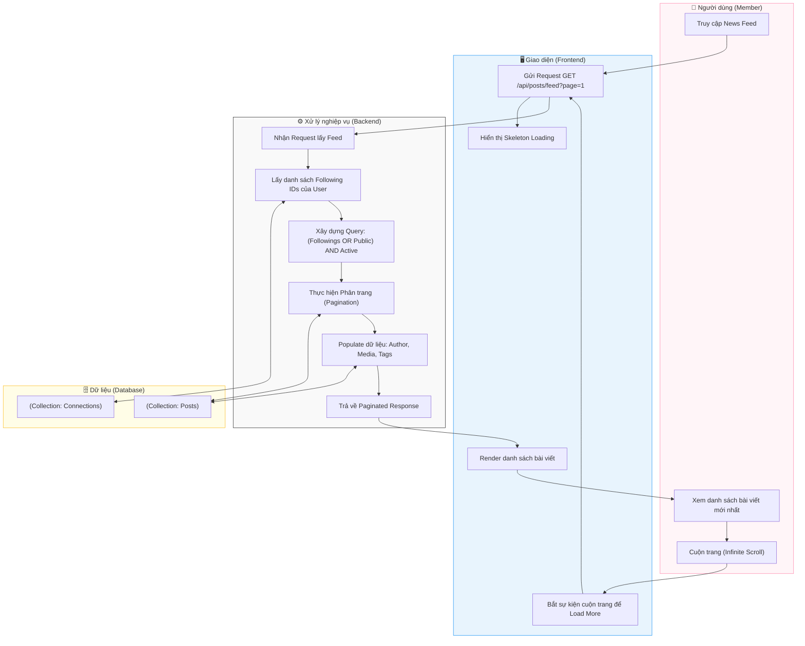

# M3-A1: News Feed Assembler - Detailed Design

> **Persona:** Senior System Architect (Tít dễ thương)
> **Mục tiêu:** Mô tả luồng tổng hợp bài viết từ nhiều nguồn để hiển thị lên dòng thời gian của người dùng.
> **Kiến trúc:** B-U-E (Boundary-UseCase-Entity).

---

## 1. Sơ đồ Activity Diagram (Mermaid)

---

## 2. Giải thích luồng hoạt động (Flow Explanation)

| Bước | Thành phần | Mô tả chi tiết |
|:---:|---|---|
| **Điều kiện lọc** | **UseCase** | Hệ thống ưu tiên bài viết từ những người mà User đang `Following`. Bài viết phải ở trạng thái `published` và `visibility` là `public` hoặc `friends`. |
| **Tối ưu hóa** | **Boundary** | Sử dụng **Infinite Scroll** để giảm tải dung lượng truyền tải, chỉ tải 10-20 bài mỗi lần cuộn. |
| **Liên kết dữ liệu** | **UseCase** | Việc **Populate** (Join) dữ liệu tác giả và hình ảnh giúp Frontend hiển thị đầy đủ thông tin mà không cần gọi thêm API. |
| **Phân trang** | **Entity** | Sử dụng `skip` và `limit` của MongoDB để quản lý phân trang chính xác. |

---

## 3. Phân tích rủi ro (Risk Audit)

| ID | Rủi ro | Giải thích | Giải pháp |
|:---:|---|---|---|
| **FA-01** | **Performance Degradation** | User theo dõi quá nhiều người khiến query chậm. | Sử dụng **Indexing** trên các trường `author`, `createdAt` và `visibility`. |
| **FA-02** | **Duplicate Content** | Bài viết bị lặp lại khi cuộn trang do có bài mới được đăng. | Sử dụng phân trang dựa trên **Cursor** (tùy vào `createdAt`) thay vì trang số (offset). |
| **FA-03** | **Stale Data** | Thông tin tác giả hoặc số Like bị cũ. | Sử dụng **React Query / SWR** ở Frontend để tự động làm mới dữ liệu sau một khoảng thời gian. |

---
*Tài liệu được biên soạn bởi **Tít dễ thương**.*
