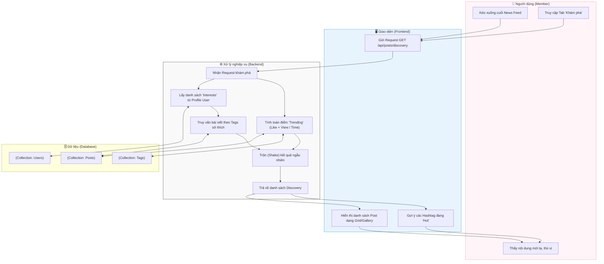

# M3-A3: Discovery Recommendation - Detailed Design

> **Persona:** Senior System Architect (Tít dễ thương)
> **Mục tiêu:** Mô tả luồng gợi ý nội dung dựa trên xu hướng (Trending) và sở thích cá nhân để tăng tính gắn kết của người dùng.
> **Kiến trúc:** B-U-E (Boundary-UseCase-Entity).

---

## 1. Sơ đồ Activity Diagram (Mermaid)

---

## 2. Giải thích luồng hoạt động (Flow Explanation)

| Bước | Thành phần | Mô tả chi tiết |
|:---:|---|---|
| **Dựa trên sở thích** | **UseCase** | Hệ thống đọc các thẻ `interests` được người dùng chọn lúc Onboarding (M1-A5) để ưu tiên bài viết có Tag tương ứng. |
| **Thuật toán Trending** | **UseCase** | Các bài viết có lượng tương tác (Like/Comment) cao trong thời gian ngắn (ví dụ: 24h qua) sẽ được đẩy lên đầu. |
| **Tính khám phá** | **UseCase** | Việc **"Shake" (Trộn ngẫu nhiên)** giúp người dùng không thấy sự lặp lại nhàm chán mỗi khi vào trang Discovery. |
| **Hashtag Hot** | **Boundary** | Hiển thị các từ khóa đang được thảo luận nhiều nhất để khuyến khích người dùng nhấp vào xem thêm. |

---

## 3. Phân tích rủi ro (Risk Audit)

| ID | Rủi ro | Giải thích | Giải pháp |
|:---:|---|---|---|
| **DR-01** | **Filter Bubble** | Hệ thống chỉ gợi ý những gì người dùng đã biết, gây hẹp tầm nhìn. | Luôn dành **20-30%** vị trí cho các nội dung ngẫu nhiên hoàn toàn không thuộc sở thích của User. |
| **DR-02** | **Cold Start** | Người dùng mới chưa có sở thích, hệ thống không biết gợi ý gì. | Mặc định hiển thị các nội dung có điểm **Global Trending** cao nhất cho người dùng mới. |
| **DR-03** | **Spam Trending** | Hacker dùng bot để "bơm" Like khiến bài viết xấu lên Trending. | Áp dụng trọng số giảm dần theo thời gian (Time decay) và kiểm tra IP/Tài khoản thực hiện tương tác. |

---
*Tài liệu được biên soạn bởi **Tít dễ thương**.*
