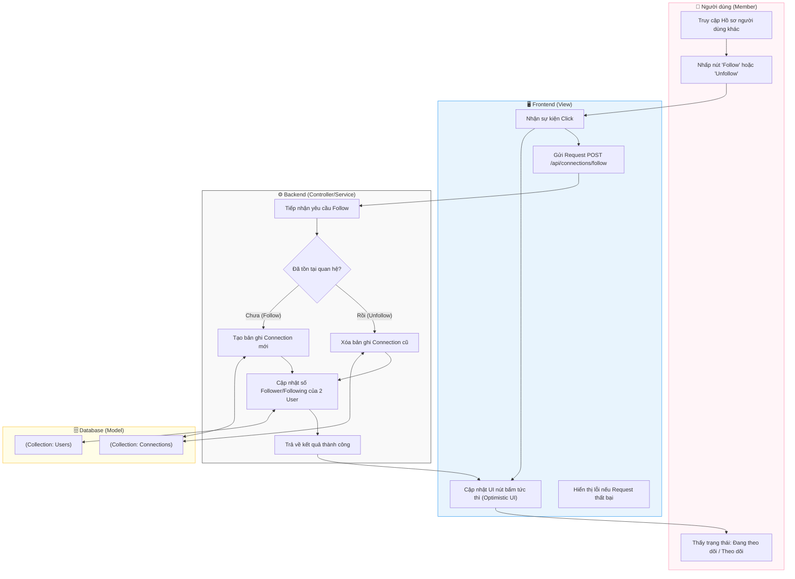

# M4-A1: Friendship Handshake - Detailed Design

> **Persona:** Senior System Architect (Tít dễ thương)
> **Mục tiêu:** Mô tả luồng thiết lập và hủy bỏ mối quan hệ theo dõi (Follow/Unfollow) giữa các thành viên.
> **Kiến trúc:** **MVC** (View - Controller/Service - Model).

---

## 1. Sơ đồ Activity Diagram (Mermaid)

---

## 2. Giải thích luồng hoạt động (Flow Explanation)

| Bước | Thành phần | Mô tả chi tiết |
|:---:|---|---|
| **Optimistic UI** | **View** | Để mang lại cảm giác mượt mà, Frontend sẽ đổi trạng thái nút Follow ngay lập tức trước khi nhận phản hồi từ Server. |
| **Logic đối xứng** | **Controller/Service** | Nếu đã Follow, hành động tiếp theo sẽ là Unfollow (Xóa record). Nếu chưa, sẽ là tạo mới record kết nối. |
| **Đồng bộ hóa số liệu** | **Controller/Service** | Backend chịu trách nhiệm tăng/giảm số lượng `followerCount` và `followingCount` trong document `User` tương ứng. |
| **Lưu trữ** | **Model** | Quan hệ được lưu trong collection `connections` với hai trường `followerId` và `followingId`. |

---

## 3. Phân tích rủi ro (Risk Audit)

| ID | Rủi ro | Giải thích | Giải pháp |
|:---:|---|---|---|
| **FH-01** | **Self-Follow** | Người dùng tìm cách tự theo dõi chính mình. | Controller kiểm tra `if (followerId === followingId)` và từ chối yêu cầu. |
| **FH-02** | **Race Condition** | Click liên tục nút Follow/Unfollow gây sai lệch số đếm. | Sử dụng các toán tử nguyên tử (Atomic operators) như `$inc` trong MongoDB thay vì ghi đè giá trị. |
| **FH-03** | **Connection Loop** | (Không áp dụng vì đây là quan hệ 1 chiều). | Hệ thống hỗ trợ quan hệ đơn phương (A follow B, B không nhất thiết follow A). |

---
*Tài liệu được cập nhật dựa trên tiếp cận **MVC & Local-First** bởi **Tít dễ thương**.*
