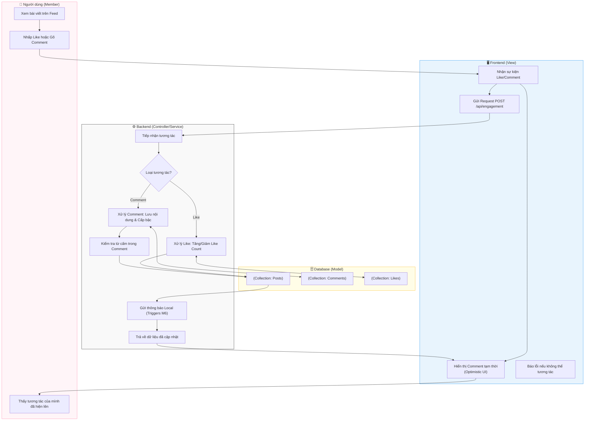

# M4-A2: Engagement Logic (Like/Comment) - Detailed Design

> **Persona:** Senior System Architect (Tít dễ thương)
> **Mục tiêu:** Mô tả luồng xử lý tương tác trực tiếp của người dùng lên bài viết, đảm bảo tính realtime và nhất quán dữ liệu.
> **Kiến trúc:** **MVC** (View - Controller/Service - Model).

---

## 1. Sơ đồ Activity Diagram (Mermaid)

---

## 2. Giải thích luồng hoạt động (Flow Explanation)

| Bước | Thành phần | Mô tả chi tiết |
|:---:|---|---|
| **Optimistic UX** | **View** | Đối với Like và Comment, hệ thống ưu tiên hiển thị ngay lập tức để tạo cảm giác "Realtime" cho người dùng. |
| **Phân loại** | **Controller/Service** | Backend phân tách logic giữa Like (Toggle trạng thái) và Comment (Lưu trữ nội dung văn bản). |
| **Bảo mật nội dung** | **Controller/Service** | Các comment cũng được chạy qua bộ lọc Sanity check (giống bài viết) để đảm bảo không chứa từ ngữ độc hại. |
| **Gắn kết** | **Model** | Mọi tương tác đều tham chiếu đến `postId` gốc để sau này có thể truy vấn: "Ai đã Like bài này?" hoặc "Các bình luận của bài này là gì?". |

---

## 3. Phân tích rủi ro (Risk Audit)

| ID | Rủi ro | Giải thích | Giải pháp |
|:---:|---|---|---|
| **EL-01** | **Spam Engagement** | User/Bot thực hiện Like/Comment liên tục với tần suất cao. | Áp dụng **Rate Limiting** (ví dụ: tối đa 60 tương tác/phút trên mỗi tài khoản). |
| **EL-02** | **Comment Ghosting** | Comment được lưu nhưng không hiện lên do lỗi Index. | Controller trả về Full Document của Comment sau khi lưu để Frontend render chính xác. |
| **EL-03** | **Deleted Post Interaction** | Tương tác vào một bài viết vừa bị xóa. | Backend kiểm tra trạng thái bài viết `status: 'published'` trước khi chấp nhận Like/Comment. |

---
*Tài liệu được cập nhật dựa trên tiếp cận **MVC & Local-First** bởi **Tít dễ thương**.*
