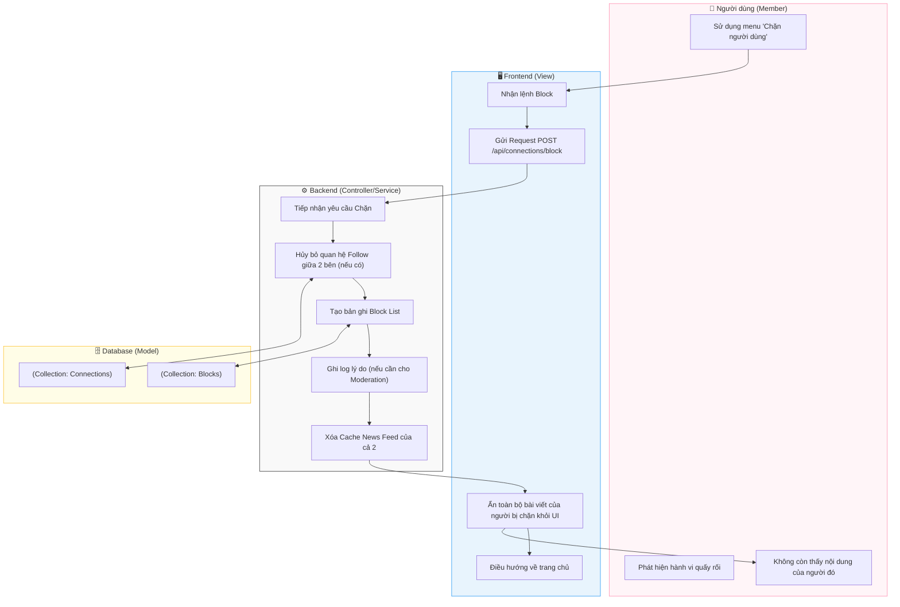

# M4-A3: Connection Privacy (Blocking) - Detailed Design

> **Persona:** Senior System Architect (Tít dễ thương)
> **Mục tiêu:** Mô tả luồng chặn người dùng để bảo vệ không gian cá nhân và an toàn trên mạng xã hội.
> **Kiến trúc:** **MVC** (View - Controller/Service - Model).

---

## 1. Sơ đồ Activity Diagram (Mermaid)

---

## 2. Giải thích luồng hoạt động (Flow Explanation)

| Bước | Thành phần | Mô tả chi tiết |
|:---:|---|---|
| **Rào cản** | **Controller/Service** | Khi thực hiện Block, hệ thống tự động thực hiện **"Double Unfollow"** (A ngừng theo dõi B và ngược lại). |
| **Bảo lưu** | **Model** | Danh sách chặn được lưu trong collection `blocks` với các trường `blockerId` và `blockedId`. |
| **Hiệu lực tức thì** | **View** | Frontend sẽ chủ động lọc sạch dữ liệu người bị chặn khỏi bộ nhớ tạm (Cache/State) để người dùng không còn thấy họ ngay lập tức. |
| **Tác động News Feed** | **Controller/Service** | Việc xóa cache giúp luồng tổng hợp tin tức (M3-A1) loại trừ người bị chặn ngay trong phiên làm việc tiếp theo. |

---

## 3. Phân tích rủi ro (Risk Audit)

| ID | Rủi ro | Giải thích | Giải pháp |
|:---:|---|---|---|
| **CP-01** | **Circular Blocking** | User A chặn B, đồng thời B cũng chặn A. | Model đảm bảo mỗi cặp (A, B) có bản ghi độc lập, hành động của người này không ảnh hưởng đến trạng thái chặn của người kia. |
| **CP-02** | **One-way Visibility** | Người bị chặn vẫn thấy bài viết qua tag hoặc comment chung. | Tuyệt đối: Logic Fetching ở mọi module (M2, M3, M4) phải lồng thêm điều kiện `blockedIds`. |
| **CP-03** | **Unblocking UX** | Người dùng muốn bỏ chặn sau này. | Cung cấp màn hình "Danh sách đã chặn" trong cài đặt tài khoản để thực hiện Unblock (Xóa record trong `blocks`). |

---
*Tài liệu được cập nhật dựa trên tiếp cận **MVC & Local-First** bởi **Tít dễ thương**.*
