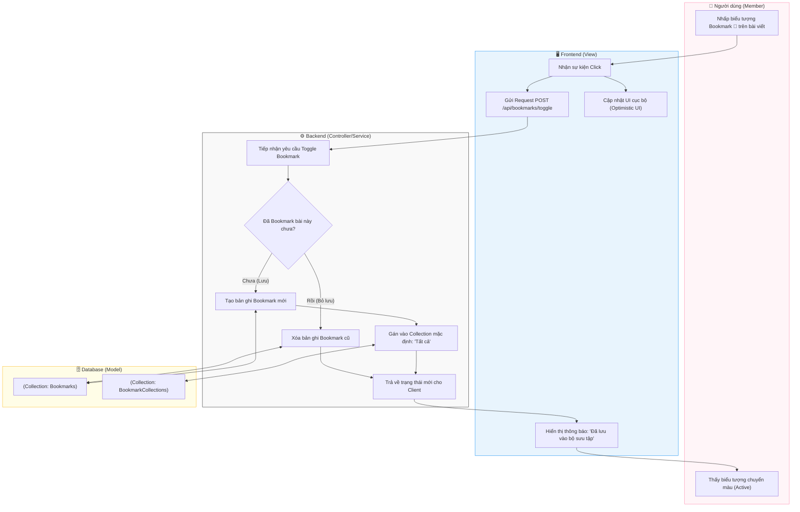

# M5-A1: Bookmark Persistence - Detailed Design

> **Persona:** Senior System Architect (Tít dễ thương)
> **Mục tiêu:** Mô tả luồng lưu và bỏ lưu bài viết, đảm bảo tính nhất quán giữa View và Model.
> **Kiến trúc:** **MVC** (View - Controller/Service - Model).

---

## 1. Sơ đồ Activity Diagram (Mermaid)

---

## 2. Giải thích luồng hoạt động (Flow Explanation)

| Bước | Thành phần | Mô tả chi tiết |
|:---:|---|---|
| **Toggle Logic** | **Controller/Service** | Hệ thống không dùng hai API riêng biệt cho Save/Unsave mà dùng chung một endpoint Toggle để đơn giản hóa logic cho View. |
| **Mặc định** | **Controller/Service** | Khi lưu lần đầu, hệ thống luôn gán bài viết vào bộ sưu tập hệ thống có tên là "Tất cả" (Uncategorized) để đảm bảo không có bookmark nào bị mồ côi. |
| **Phản hồi nhanh** | **View** | Sử dụng **Optimistic UI** để icon đổi màu ngay khi click, mang lại cảm giác ứng dụng phản hồi tức thì. |
| **Lưu trữ** | **Model** | Mỗi record trong `bookmarks` chứa bộ ba: `userId` - `postId` - `collectionId`. |

---

## 3. Phân tích rủi ro (Risk Audit)

| ID | Rủi ro | Giải thích | Giải pháp |
|:---:|---|---|---|
| **BP-01** | **Redundant Records** | Click quá nhanh tạo ra nhiều bản ghi trùng lặp cho cùng một bài viết. | Sử dụng **Compound Index** duy nhất (Unique) trên `userId` + `postId` trong Model để DB tự chặn rác. |
| **BP-02** | **Post Deletion** | Bài viết gốc bị xóa nhưng Bookmark vẫn còn gây lỗi 404. | Sử dụng **Cascade Delete** hoặc Service của Post (M2) phải gửi tín hiệu xóa toàn bộ Bookmark liên quan khi Post bị gỡ. |
| **BP-03** | **Access Denied** | Lưu bài viết từ một tài khoản vừa chuyển sang chế độ Private/Blocked. | Controller kiểm tra lại quyền xem bài viết (`visibility`) ngay tại thời điểm thực hiện lưu. |

---
*Tài liệu được cập nhật dựa trên tiếp cận **MVC & Local-First** bởi **Tít dễ thương**.*
