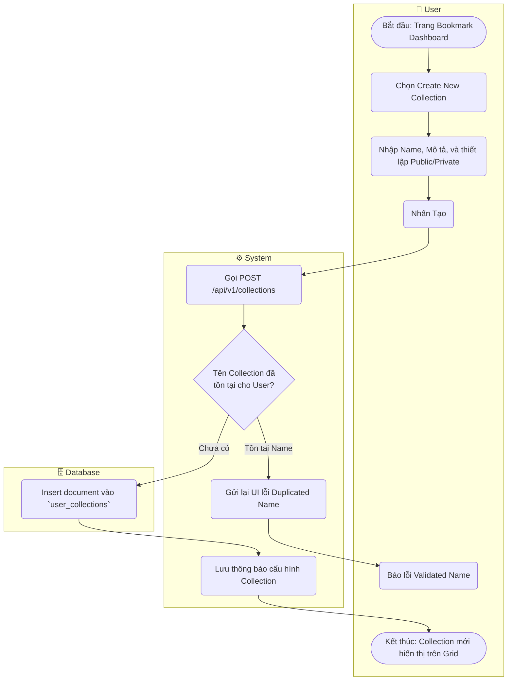

# Flow Diagram: Quản lý collection bookmark (UC20)

## Assumptions
- Dữ liệu `isPublic: false` mặc định giúp Collection có thể được chia sẻ cho người khác.
- Mỗi User không được phép có hai Collection trùng Tên.
