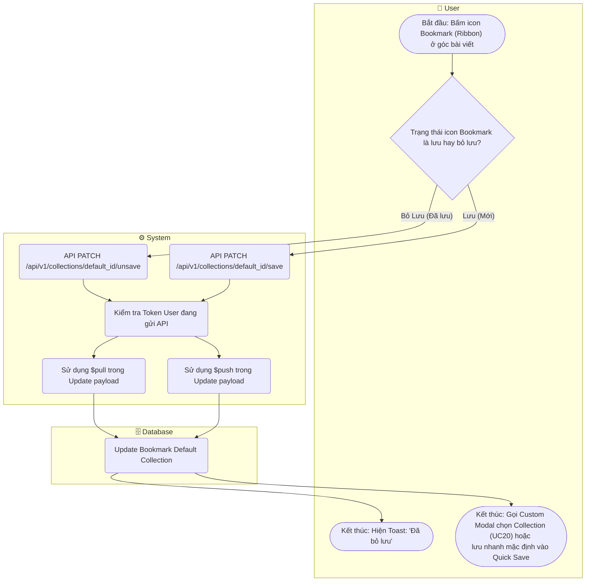

# Flow Diagram: Lưu/Bỏ lưu bài viết Bookmark (UC19)

## Assumptions
- Spec M5 quy định Bookmark mặc định nằm ở Collection "My Bookmarks" (Dạng Quick Save).
- Backend Collection `user_collections` chứa items dạng list embedded object.
