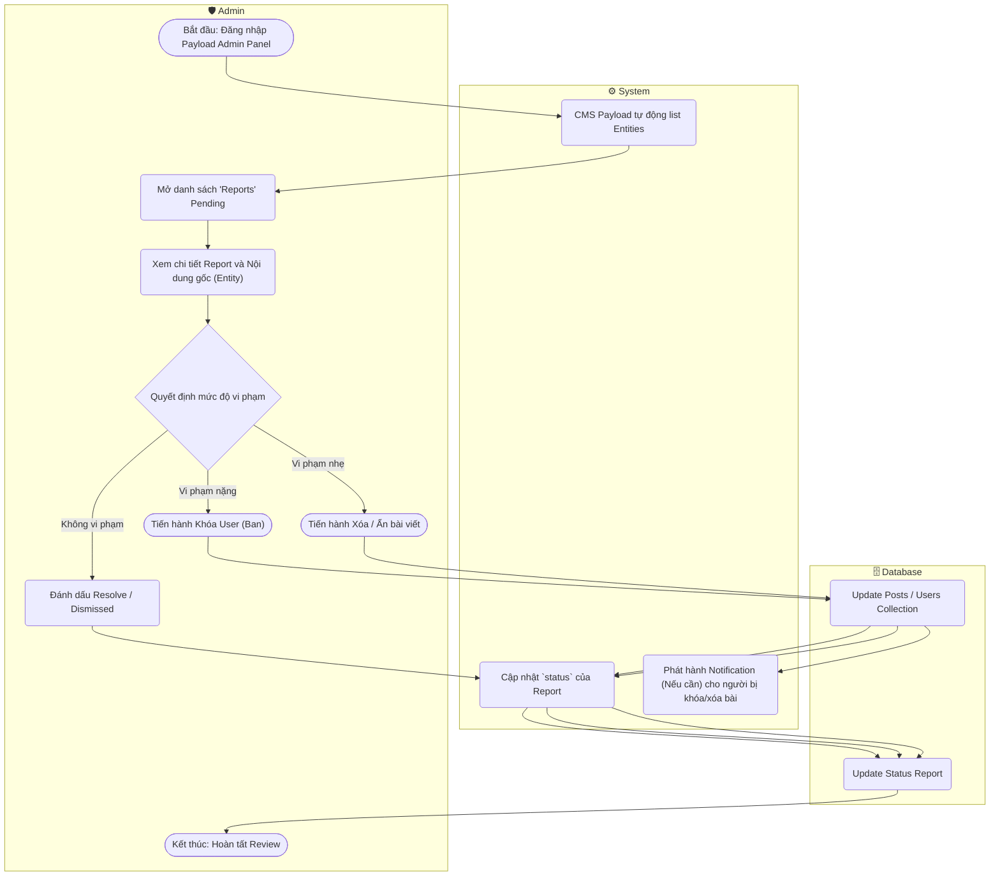

# Flow Diagram: Kiểm duyệt / Xem xét báo cáo vi phạm (UC24)

## Assumptions
- Tiến trình quản trị kiểm duyệt diễn ra ngay trên Panel admin được cấp sẵn bởi PayloadCMS, nơi mọi collection được bày sẵn mà không cần custom Code Logic Dashboard riêng. Việc update thực thi qua Payload UI.
- Có thẻ xử lý Notification trả về người dùng nếu họ bị báo cáo thành công.
