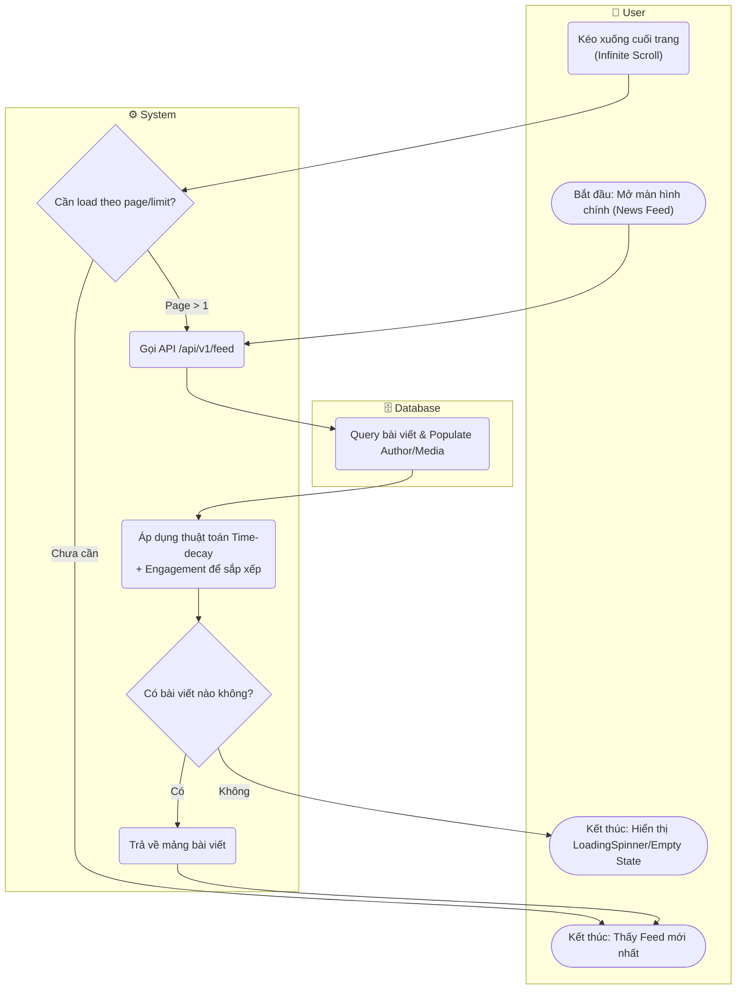

# Flow Diagram: Xem news feed (UC11)

## Assumptions
- Thuật toán Ranking Score `score = (likesCount + commentsCount*2 + sharesCount*3) / (1 + hoursSincePost / 24)^1.8` đã được cron job và hook tính sẵn trong field `rankingScore` ở data layer (đã spec trong M3). Query DB chỉ cần `sort: '-rankingScore'`.
