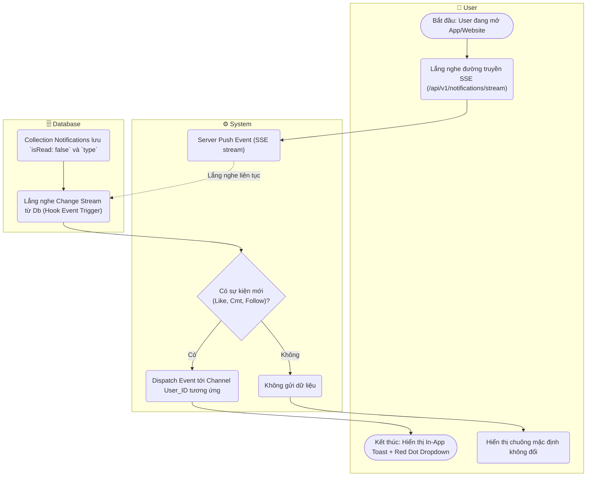

# Flow Diagram: Nhận thông báo realtime (UC21)

## Assumptions
- Dùng Server-Sent Events (SSE) để tiết kiệm so với WebSocket, PayloadCMS backend support kết nối Stream Data.
- Sự kiện trigger SSE dựa trên Hook `afterChange` của Notifications collection.
