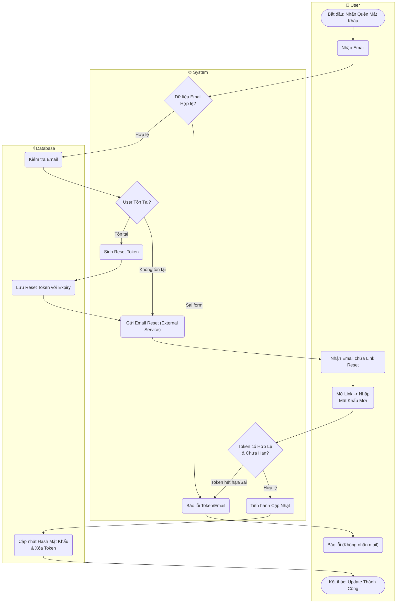

# Flow Diagram: Quên/Đặt lại mật khẩu (UC05)

## Assumptions
- System sẽ luôn luôn báo gửi mail thành công để tránh Data Enumeration Attack (kẻ tấn công kiểm tra được email ai đang có trong hệ thống bằng cách quên password).
- Token sẽ có Expiry Time (thường 1 giờ - 24 giờ).
