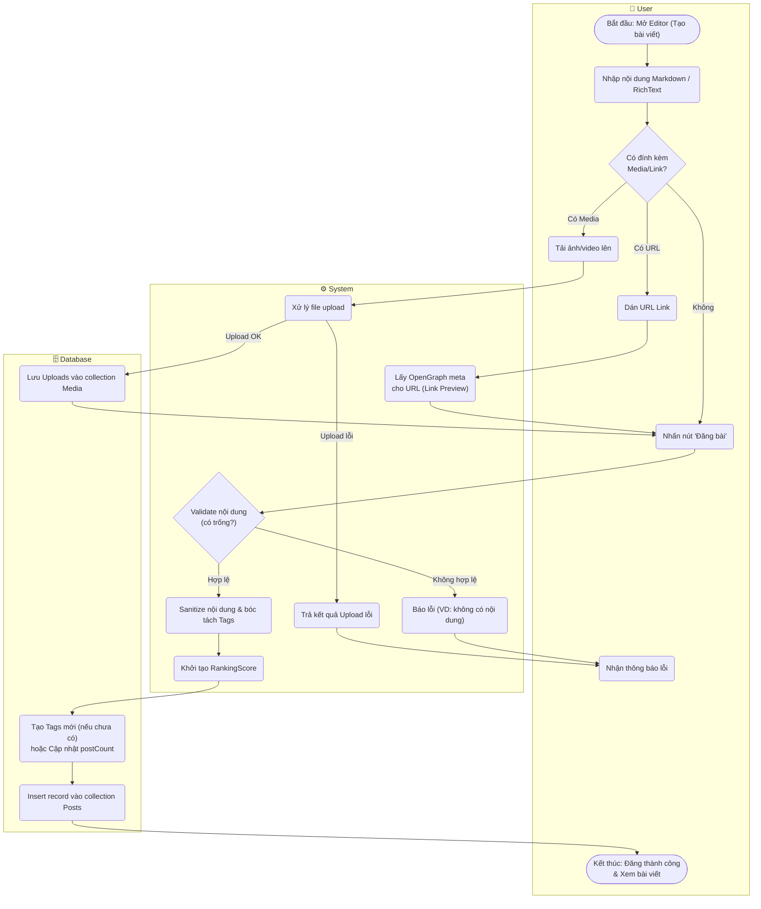

# Flow Diagram: Tạo bài viết (UC08)

## Assumptions
- Hook `beforeChange` của PayloadCMS xử lý sanitize và extract keywords/tags tự động từ trường content.
- Media upload có thể gọi API Upload độc lập trước, sau đó gửi ID về khi tạo Post (`Array of Uploads`).
