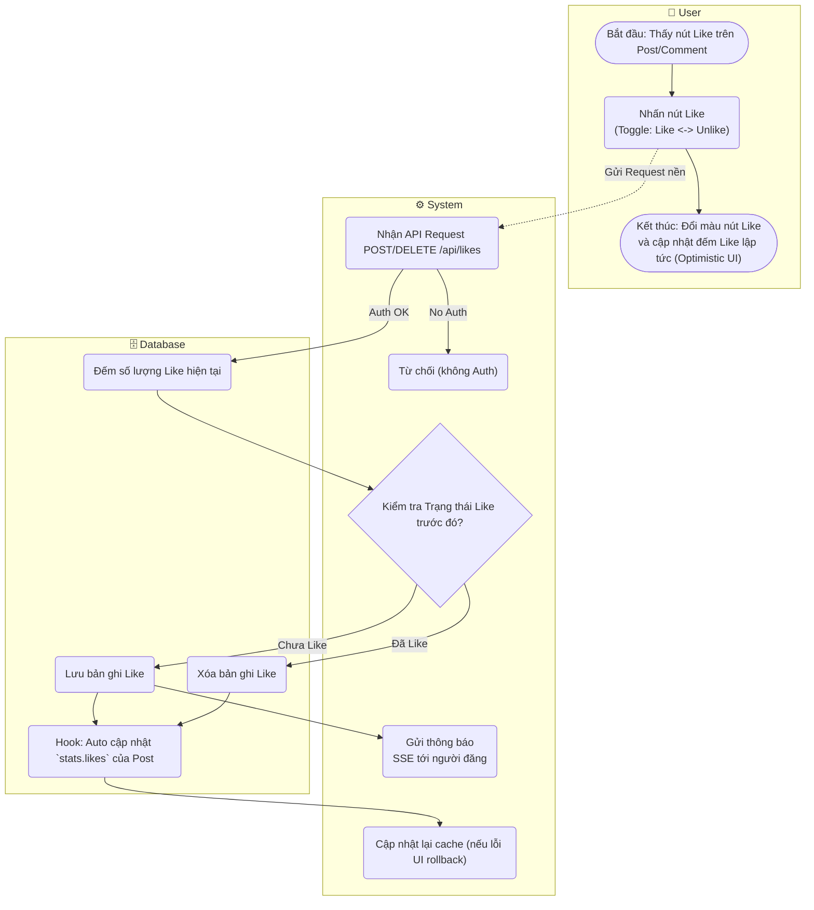

# Flow Diagram: Like/Unlike bài viết (UC14)

## Assumptions
- "Optimistic UI" thường được áp dụng cho tính năng Like: giao diện trả về trạng thái Like và tăng bộ đếm **ngay lập tức** mà không chờ server xử lý, nếu server báo lỗi sẽ tự động hoàn tác. Lên diagram thể hiện luồng UI hoàn thành sớm hơn nền.
