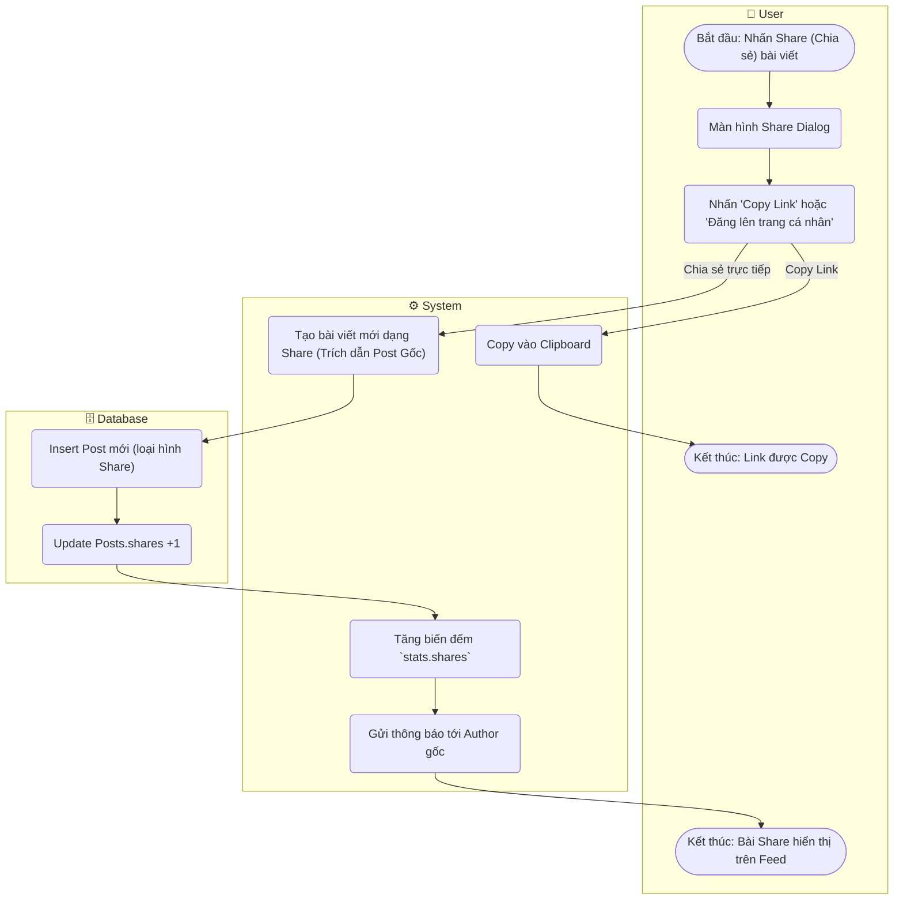

# Flow Diagram: Chia sẻ bài viết (UC16)

## Assumptions
- Spec M4 có ghi "SharesCount" nhưng không nói rõ Repost là copy link hay tạo Post mới. Pattern phổ biến: tạo bài viết mới + nhúng Link/Preview hoặc Ref Post ID. Ở đây dùng giả định tạo bài Shared Post.
