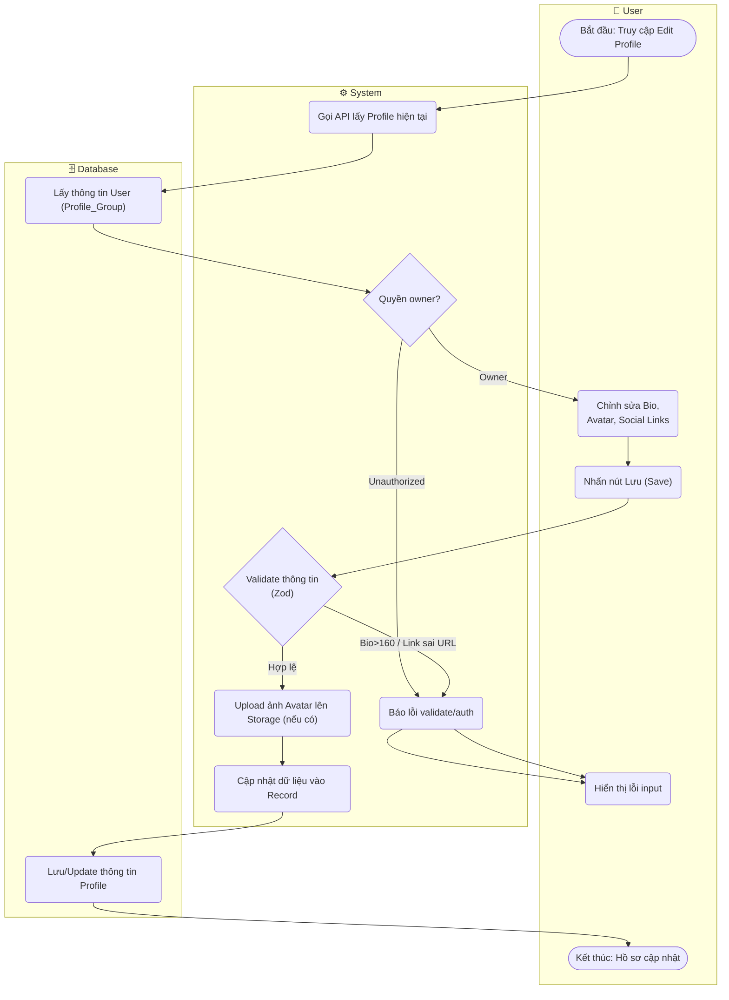

# Flow Diagram: Quản lý hồ sơ cá nhân (UC06)

## Assumptions
- Việc Upload Avatar được thực thi riêng rẽ, API Profile sẽ lưu link URL hoặc reference của thẻ Media.
- API Route `/api/users/:id`.
- `social_links` phải là valid URL.
