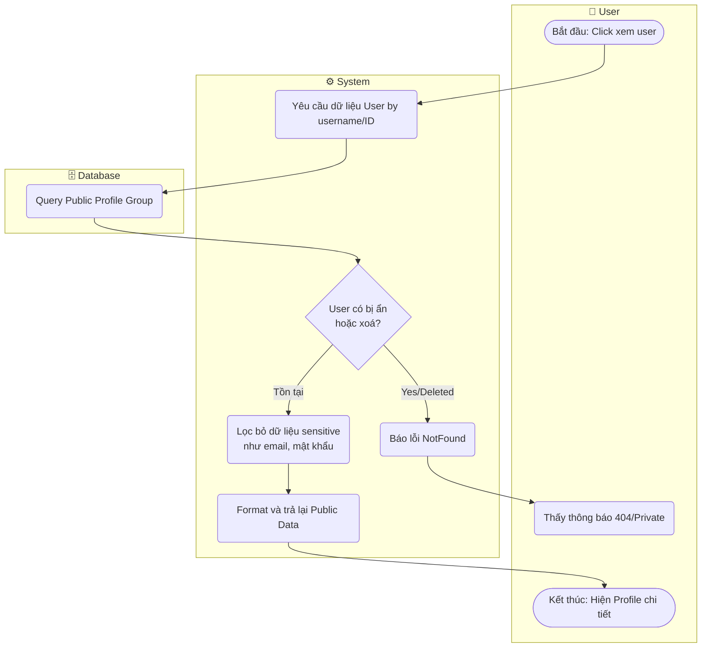

# Flow Diagram: Xem hồ sơ công khai (UC07)

```mermaid
flowchart TD
  subgraph User ["👤 User"]
    direction TB
    U1(["Bắt đầu: Click xem user"])
    U2(["Kết thúc: Hiện Profile chi tiết"])
    U3("Thấy thông báo 404/Private")
  end
  subgraph System ["⚙️ System"]
    direction TB
    S1("Yêu cầu dữ liệu User by username/ID")
    S2{"User có bị ẩn<br/>hoặc xoá?"}
    S3("Lọc bỏ dữ liệu sensitive<br/>như email, mật khẩu")
    S4("Format và trả lại Public Data")
    S5("Báo lỗi NotFound")
  end
  subgraph DB ["🗄️ Database"]
    direction TB
    D1("Query Public Profile Group")
  end

  U1 --> S1 --> D1
  D1 --> S2
  
  S2 -- "Yes/Deleted" --> S5 --> U3
  S2 -- "Tồn tại" --> S3
  S3 --> S4
  S4 --> U2

  %% UC-ID: UC07
  %% Business Function: Xem hồ sơ công khai
```

## Assumptions
- Spec yều cầu "Bypass password field trong mọi query Read trừ lúc Auth".
- Read Access cho Profile Group là Anyone (Guest + Member).
