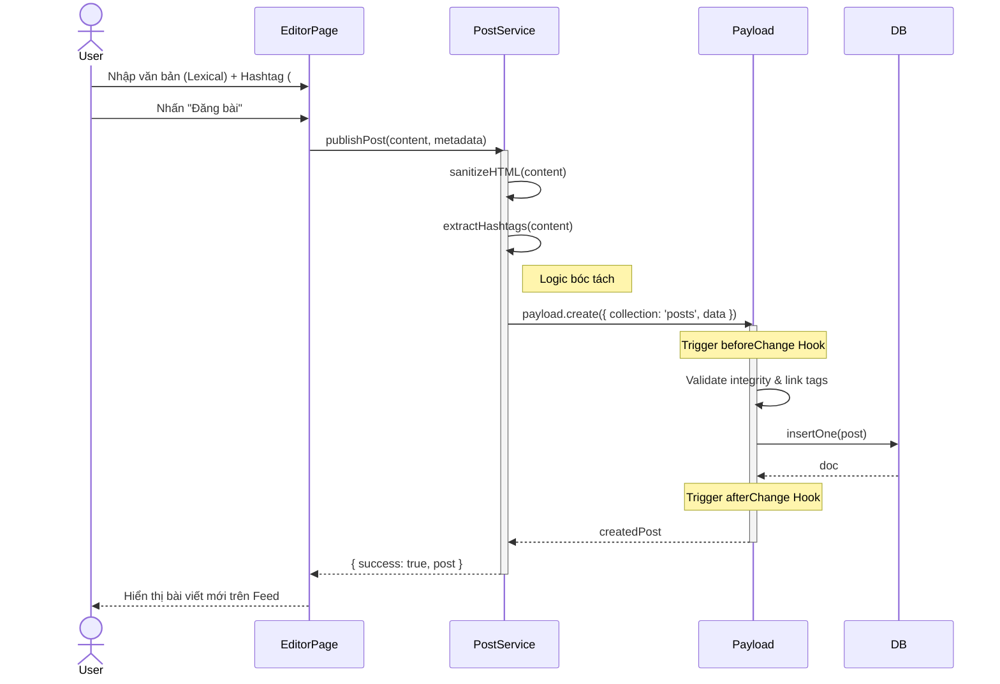
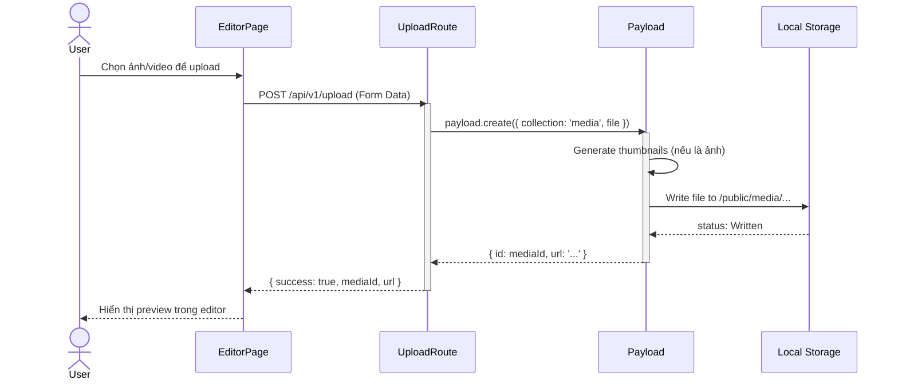
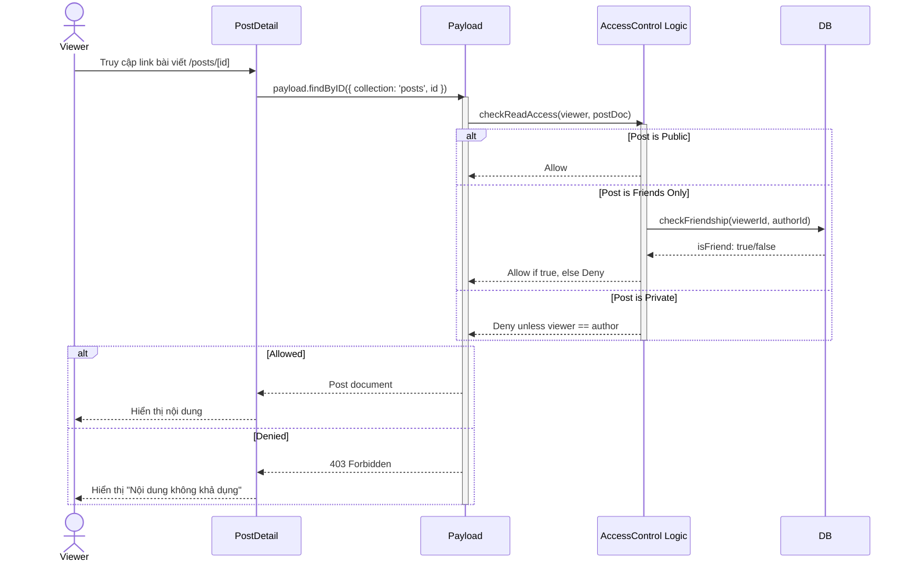
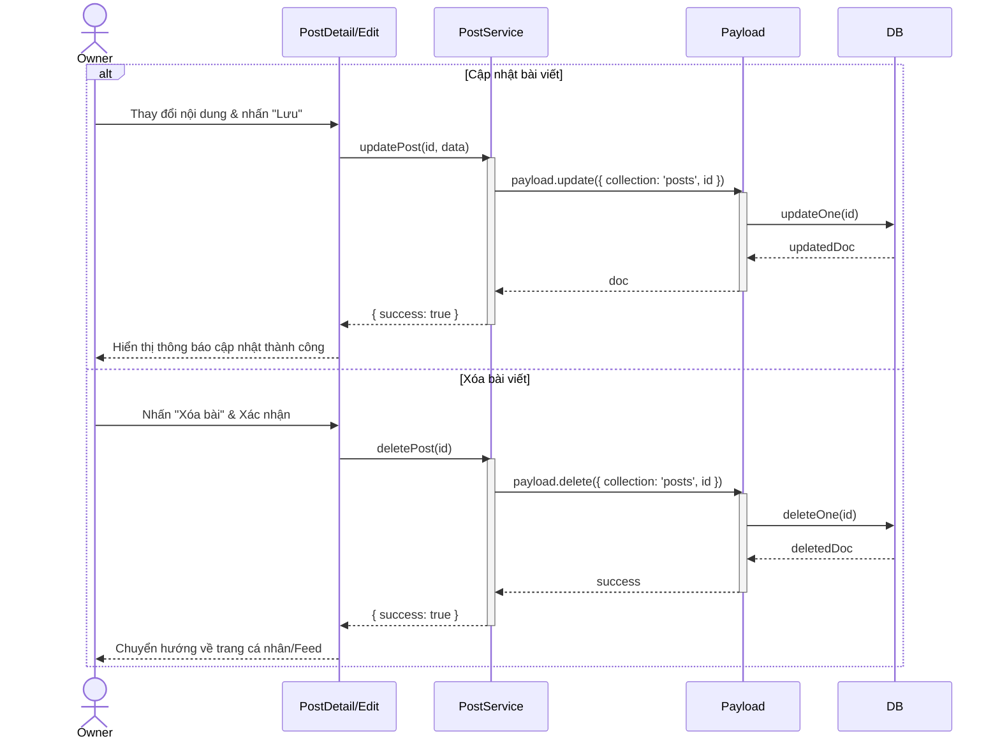

# Sequence Diagram: M2 - Content Engine

> **Module:** Core Value
> **Mục tiêu:** Mô tả chi tiết quá trình sáng tạo và quản lý nội dung bài viết.

---

## ✍️ 1. Kịch bản: Soạn thảo và Xuất bản bài viết (M2-A1 & A3)

Mô tả luồng từ khi người dùng viết bài đến khi hệ thống bóc tách tag và kiểm tra tính toàn vẹn.

---

## 🖼️ 2. Kịch bản: Xử lý Media đính kèm (M2-A2)

Mô tả luồng tải ảnh lên server cục bộ (Local Storage).

---

## 🔒 3. Kịch bản: Thực thi quyền riêng tư (M2-A4)

Mô tả cách hệ thống áp dụng Access Control khi người khác xem bài viết.

---

## 🗑️ 4. Kịch bản: Cập nhật và Xóa bài viết (M2-A1)

Mô tả luồng người dùng sửa đổi hoặc loại bỏ nội dung đã đăng.

---
*Ghi chú từ Tít dễ thương: Tất cả các thao tác cập nhật và xóa đều được Payload Access Control kiểm tra quyền sở hữu (Owner) nghiêm ngặt trước khi thực thi.* 🥰
