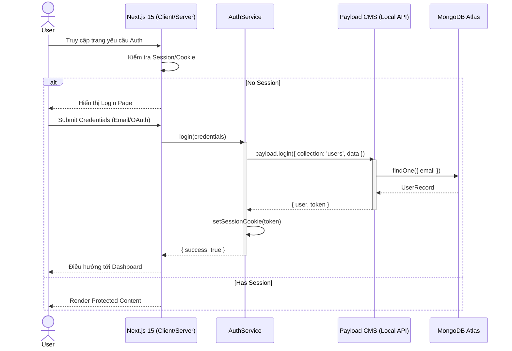
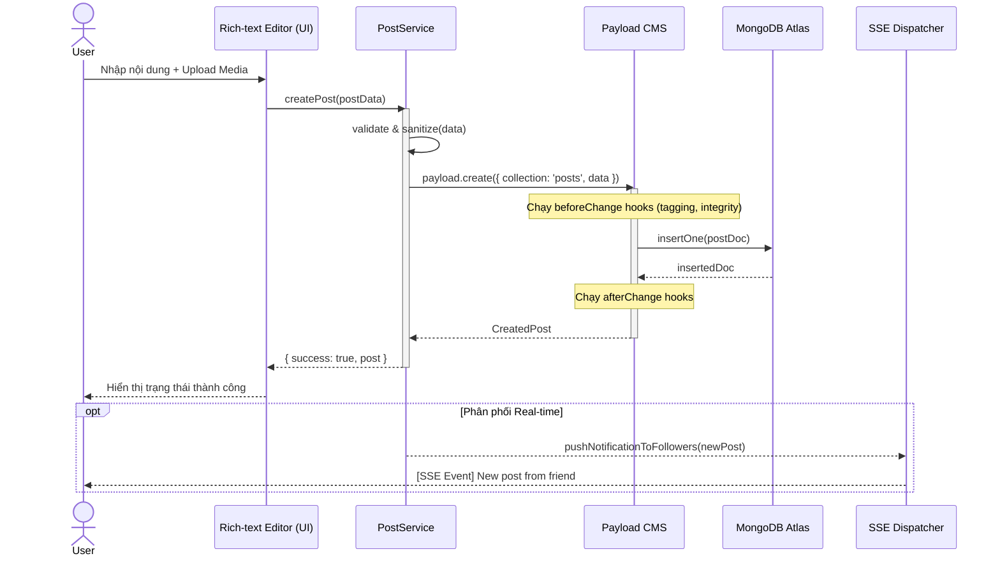
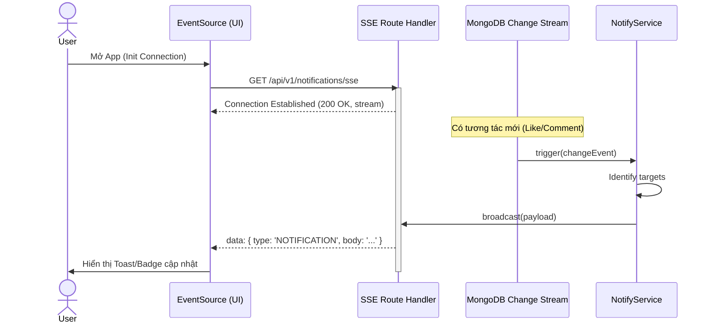

# Global Architecture Flows

> **Mục tiêu:** Mô tả các luồng tương tác cấp cao giữa các thành phần kiến trúc chính trong hệ thống NeoSocial (Next.js 15 + Payload CMS 3.x).

---

## 🔐 1. Identity & Authorization Pipeline (Luồng định danh)

Sơ đồ này mô tả cách hệ thống xử lý từ khi người dùng chưa đăng nhập đến khi được cấp quyền truy cập vào các tài nguyên bảo mật.

---

## 📝 2. Content Lifecycle (Luồng vòng đời nội dung)

Mô tả quá trình từ khi người dùng tạo bài viết đến khi bài viết được xử lý và sẵn sàng để phân phối.

---

## 📡 3. Real-time Engagement Loop (Luồng tương tác real-time)

Mô tả cơ chế Server-Sent Events (SSE) để đẩy thông báo và cập nhật feed mà không cần tải lại trang.

---
*Fidelity Note: Các sơ đồ này tuân thủ kiến trúc Local API của Payload 3.x và cơ chế SSE được thống nhất trong arhitacture-V2.md.*
